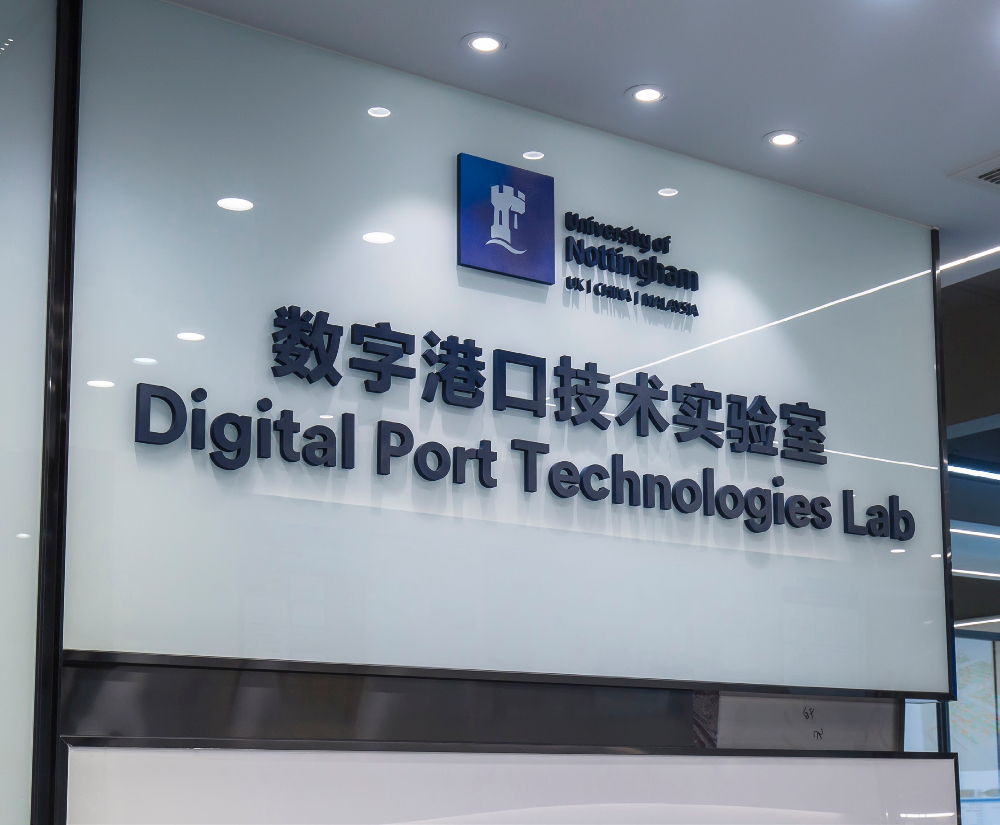
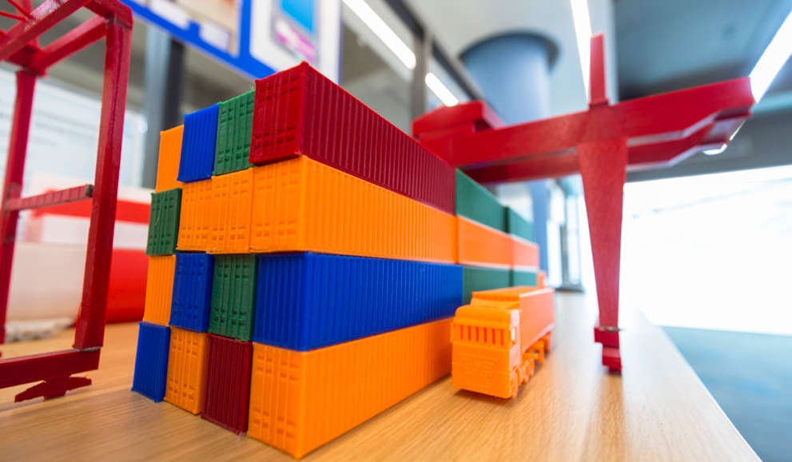
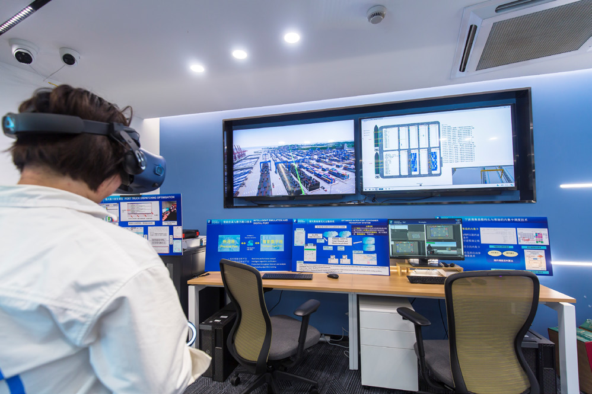
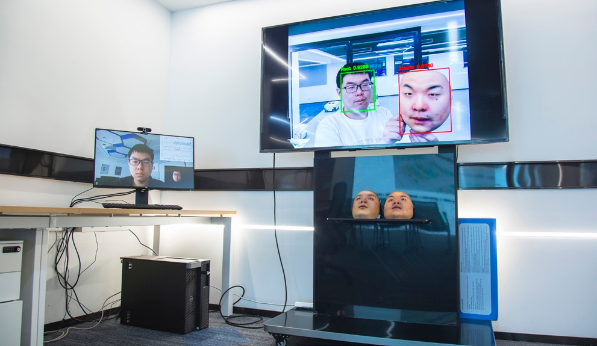
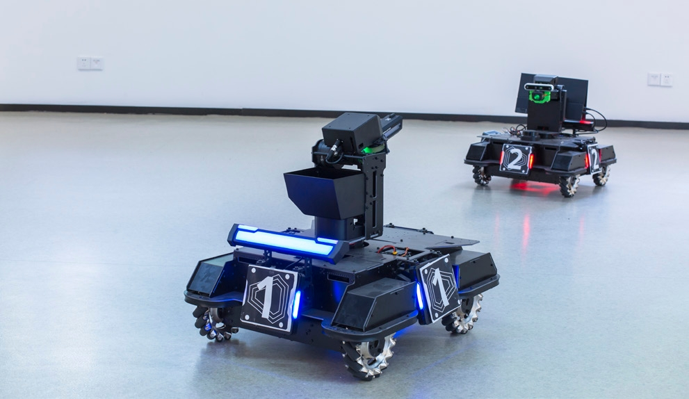

# 简介 Introduction

[← 返回总目录](../README.md)

数字港口技术实验室于 2019 年 12 月建立，并在 2023 年获评宁波市重点实验室（A 类）。实验室旨在研发面向次世代智慧港口的尖端技术与系统，并培养人工智能与数字化领域的国际一流人才，重点聚焦于以港口为核心应用场景下的 5G/6G 通信、物联网、大数据分析、仿真建模、数字孪生、港口专用大型 AI 模型、计算智能、强化学习、深度学习、边缘计算、运筹学以及大规模优化等领域。实验室拥有世界一流的设施与场地，总面积超 3000 平方米，致力于打造集科研实验与能力展示于一体的综合平台。目前团队包括 40 余名科研人员及 80 多名博士研究生。近年来，实验室成功获批多项重大科研项目，包括中国国家自然科学基金、浙江省杰出科学家基金及宁波市"科技创新 2025"重大专项，累计经费超 4000 万元，其中部分为与宁波港合作的联合项目。

> The Digital Port Technologies Lab was initially established in December 2019 and subsequently awarded with Ningbo Municipal Key Lab (Class A) in 2023. The aims of the lab are to develop the cutting-edge technologies and systems for the next generation intelligent port, and to cultivate world class talent in AI and digitalisation. This includes, but not limited to, the innovative use of the latest technologies, with port as main application scenario, in 5G/6G, IoT, big data analytics, simulation, digital twin, port focused large AI models, computational intelligence, reinforcement learning, deep learning, edge computing, operations research, and large-scale optimization. The lab has world-class facilities and space that occupy over 3000 square meters, and is designed to be a combined platform for both research experiments and capability demonstrations. The lab currently has over 40 academics and 80+ PhD students. Over the years, the lab has had multiple funding successes, including projects from National Natural Science Foundation of China (NSFC), Zhejiang Outstanding Scientist Fund and Ningbo Science and Technology Innovation 2025 Programme with total funding of over RMB 40 million, some of which are joint projects in collaboration with Ningbo Port.

