# 实验室人员 Lab Members

[← 返回总目录](../README.md) · [← 团队介绍](overview.md)

## 实验室主任 Director of Lab

### 白瑞斌 Ruibin Bai

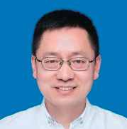

**实验室主任** · 计算机科学系教授

- 浙江省自然科学基金杰青；浙江省"钱江人才"计划；浙江省高等学校中青年学科带头人；英国诺丁汉大学博士（PhD, University of Nottingham, UK）
- SCI 期刊 *EJOR*、*TEVC*、*Networks* 编委
- 高质量学术论文 110 余篇，包括 *TRB*、*INFORMS JOC* 等 A 类期刊；主持国家自然基金及省市项目 20 余项，科研经费 1400 余万元；培养博士生 10 余名

**研究方向**：计算机科学与运筹学（Computer Science and Operations Research）

---

## 实验室副主任 Deputy Director of Lab

### Alain Chong

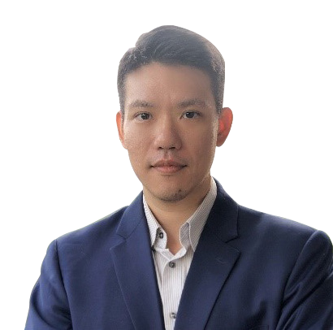

**实验室副主任** · 全球事务与合作副校长 · 信息系统与数字创新教授

- 马来西亚十大杰出青年；宁波 3315 外籍专家；外国优秀青年学者研究基金项目获得者；宁波茶花奖获得者
- *Industrial Management & Data Systems* 联合主编；Elsevier 中国顶级被引量学者；斯坦福-Elsevier 世界前 2% 被引量学者
- 英国诺丁汉大学博士；马来西亚多媒体大学博士；香港理工大学博士后；发表 SSCI/SCI 期刊论文 100 余篇

**研究方向**：信息系统与运作管理；计算机科学与运筹学

---

## 方向带头人 / 核心成员 Direction Leaders / Core Members

### 任剑锋 Jianfeng Ren

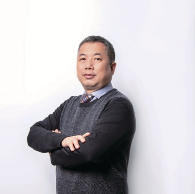

**方向带头人** · 计算机科学系副教授 · 新加坡南洋理工大学博士

**研究方向**：机器学习、计算机视觉（Machine Learning, Computer Vision）

在包括《IEEE 图像处理汇刊》、《模式识别》等高影响力国际期刊和国际会议上发表论文几十余篇。

---

### 翁莹 Ying Weng

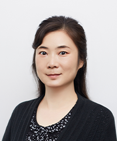

**核心成员** · 计算机科学系教授

**研究方向**：计算机视觉、图像处理、物联网、无线网络安全与服务质量

拥有超过 12 年的教学和研究经验；中科院国家重点基础研究发展计划（973 计划）成员。

---

### 何祥健 Sean He

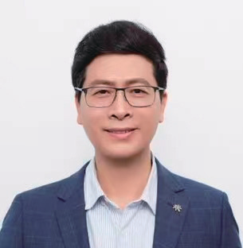

**方向带头人** · 计算机科学系教授 · 国家级讲席学者

**研究方向**：计算机视觉、数据分析和机器学习

连续入选斯坦福大学"世界顶尖 2% 科学家"榜单；曾在 ACMMM、MMM、ICDAR、IEEE Big Data Service、IEEE TrustCom、IEEE CIT、IEEE AVSS、IEEE ICPR、IEEE ICARCV 等多个国际会议担任主席；曾带领悉尼科技大学和香港理工大学联合研究团队获 IEEE 信号处理学会 2017 年 VIP 杯亚军、2019 年 VIP 杯冠军，以及 2026 年国际生物医学成像会议（ISBI）超声影像基础模型挑战赛冠军。

---

### 卢正 Zheng Lu

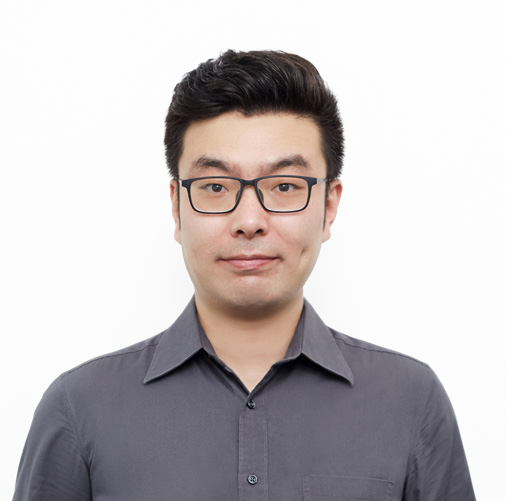

**方向带头人** · 计算机科学系助理教授 · 新加坡国立大学博士

**研究方向**：计算机科学

发表高水平论文几十余篇，科研成果应用于敦煌研究院、美国康奈尔大学医学院等机构。

---

### 曹聪 Cong Cao

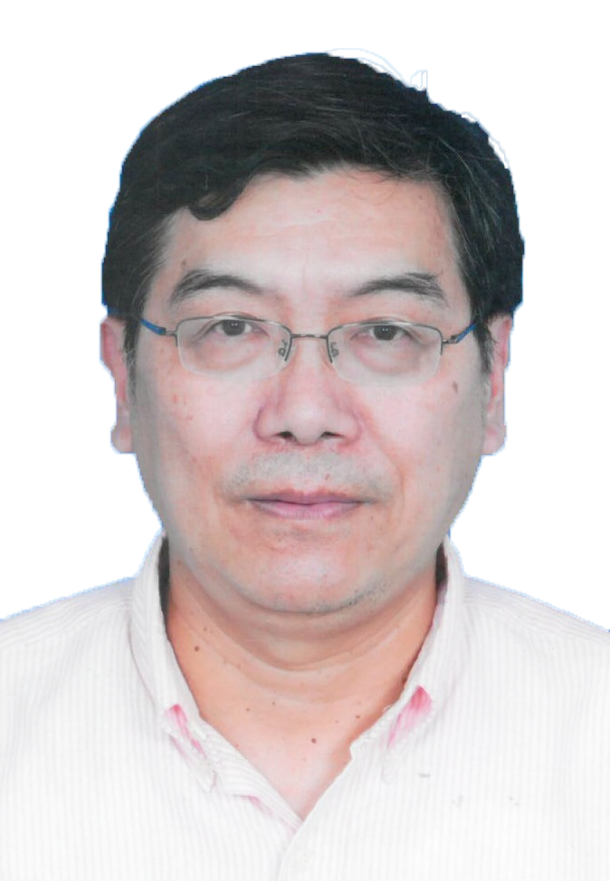

**方向带头人** · 宁波诺丁汉大学商学院创新学教授

**研究方向**：科技政策与体制改革（Science and technology policy and institutional reform）

获美国、欧盟以及中国的国际与国家级基金资助（NSF、FP7、NSFC）；受邀撰写 2020 年《联合国教科文组织科学报告》"中国科学"章节；发表国际期刊及论文集论文数十篇。

---

### Dave Towey

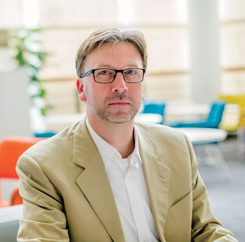

**核心成员** · 计算机科学系教授 · 计算机科学系主任

**研究方向**：计算机科学与语言学

拥有 20 余年的计算机科学和语言学的教学经历；加入宁波诺丁汉大学前，在北京师范大学-香港浸会大学联合国际学院（UIC）从事教学科研工作。

---

### Anthony Belloti

**核心成员** · 计算机科学系教授

曾任英国爱丁堡大学信用风险研究中心博士后研究员。

**研究方向**：机器学习与信用风险模型、模型风险（Machine Learning and Credit Risk Model, Model Risks）

---

### 华秀萍 Xiuping Hua

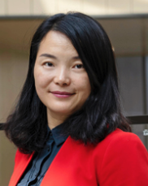

**核心成员** · 金融、会计与经济系教授

**研究方向**：资产定价、公司金融、衍生品、金融科技、创新金融和普惠金融；机器学习与信用风险模型、模型风险

中国人民银行宁波分行普惠金融研究中心秘书长；宁波诺丁汉大学区块链实验室主任；曾任君润资本兼职合伙人兼副总裁。

---

### Boon Giin Lee

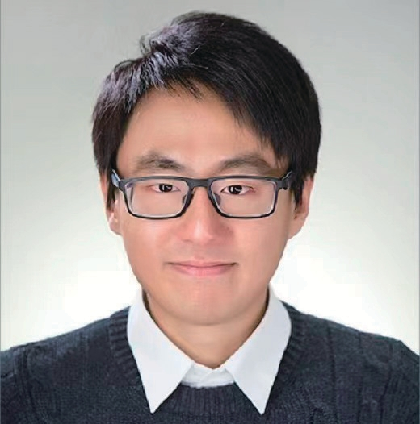

**核心成员** · 人机交互实验室负责人 · 计算机科学系副教授

**研究方向**：人机交互、智能传感与扩展现实技术（HCI, Intelligent Sensor and Extended Reality）

斯坦福大学 2022 与 2023 年"全球前 2% 顶尖科学家"。

---

### Fazl Ullah Khan

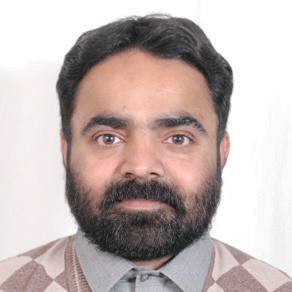

**核心成员** · 计算机科学系助理教授 · IEEE 高级会员

**研究方向**：计算机网络、计算机和网络安全、软件工程（Computer Network, Computer Architecture and Network Security, Software Engineering）

IEEE、Springer、Frontier 和 PLOS 等出版社旗下多个期刊的副主编；拥有超过 12 年的教学和研究经验。

---

### 薛宁 Ning Xue

**核心成员** · 计算机科学系助理教授（照片待补充）

- 甬江人才（Yongjiang Talent Project）
- 2019 年国际运筹学与企业系统会议线性规划分会主席，以及 2018 年 IEEE 计算智能世界大会自动参数调优算法分会主席

**研究方向**：人工智能、计算智能和组合优化

---

### 张茜 Qian Zhang

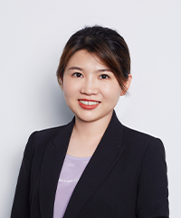

**核心成员** · 计算机科学系助理教授

**研究方向**：图像处理、计算机视觉、机器学习（Image Processing, Computer Vision, Machine Learning）

---

### 李家炜 Jiawei Li

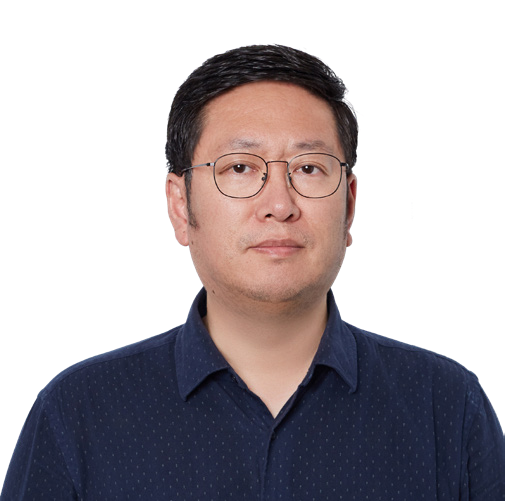

**方向带头人** · 计算机科学系助理教授 · 英国诺丁汉大学博士后

**研究方向**：计算机与人工智能（Computer Science and Artificial Intelligence）

在演化计算和模糊逻辑领域《IEEE 模糊系统汇刊》等顶级期刊和会议发表高质量学术论文 40 余篇。

---

### Matthew Pike

**核心成员** · 计算机科学系副教授

理工学院数字化学习总监（Director of Digitalised Learning of Faculty of Science and Engineering）。

---

### 于恒 Heng Yu

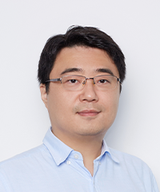

**核心成员** · 计算机科学系副教授

曾任 IEEE 电路与系统汇刊副主编；2022 年获得迪林勋爵奖（Lord Dearing Award）。

**研究方向**：嵌入式系统设计（Embedded Systems Design）

---

### 姚远 Yuan Yao

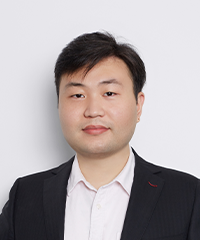

**核心成员** · 计算机科学系助理教授

**研究方向**：自主智能体与多智能体系统（Autonomous Agents and Multi-Agent Systems）

智能体推理、智能体学习、智能体架构与编程语言、逻辑与验证。

---

### 崔天翔 Tianxiang Cui

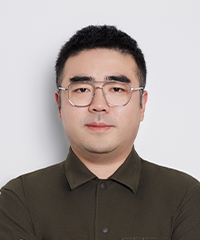

**核心成员** · 计算机科学系助理教授 · IEEE 高级会员

**研究方向**：计算智能、运筹研究、机器学习以及强化学习（Computational Intelligence, Operation Research, Machine Learning and Reinforcement Learning）

前平安算法研究员；前华为高级 AI 工程师。

---

### 杜何珊 Heshan Du

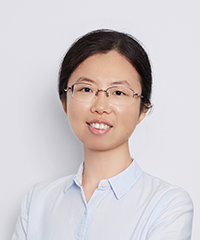

**核心成员** · 计算机科学系副教授

**研究方向**：逻辑、知识表示和推理、地理信息系统、运筹学、机器学习以及强化学习（Logic, Knowledge Representation and Reasoning, Geographic Information Systems, Operations Research, Machine Learning and Reinforcement Learning）

---

### 靳欢 Huan Jin

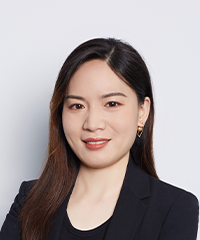

**核心成员** · 计算机科学系助理教授

**研究方向**：优化与机器学习（Optimisation and Machine Learning）

国家自然科学优秀青年基金、联合基金重点项目评审专家；在 *TR Part C*、*CIE*、*IJPR* 等期刊发表论文 10 余篇。
