# 成果介绍 · 专利、软著与奖项 Achievements

[← 返回总目录](../README.md) · [论文发表 →](publications.md)

实验室获取了多项专利与软件著作权，并在多项竞赛中获得奖项。

## 专利 Patents

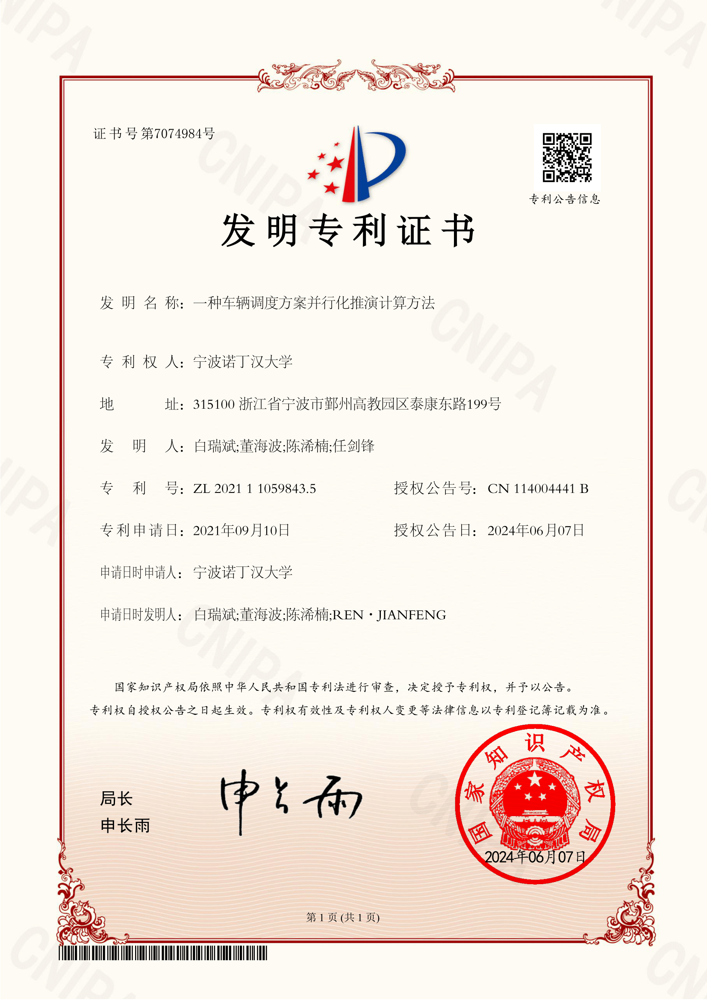

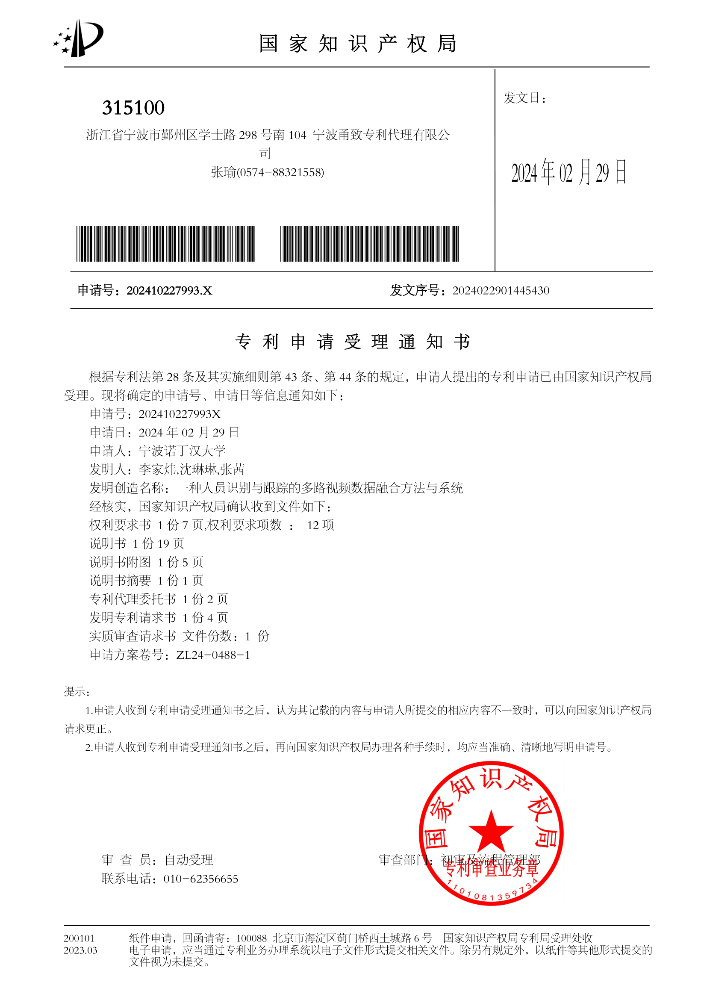

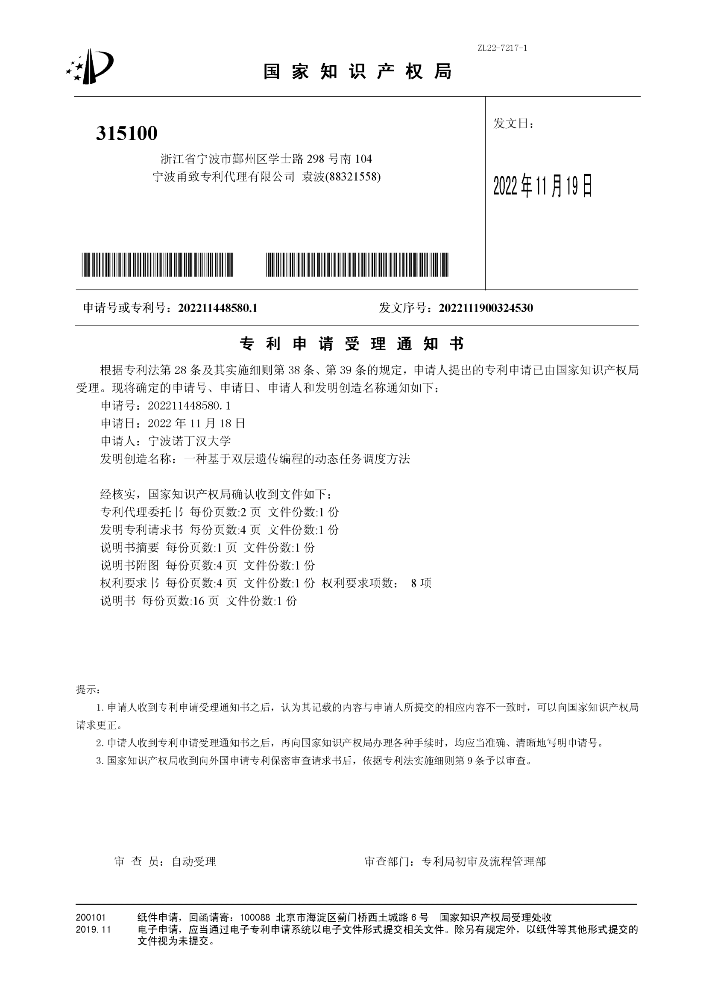

## 软件著作权 Software Copyrights

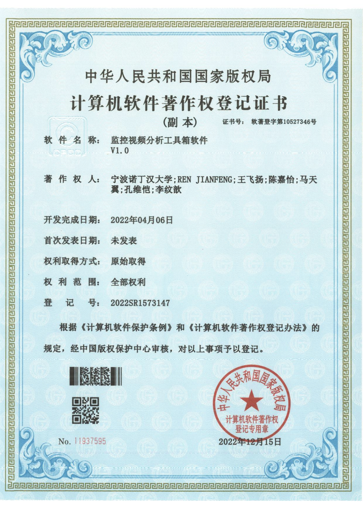

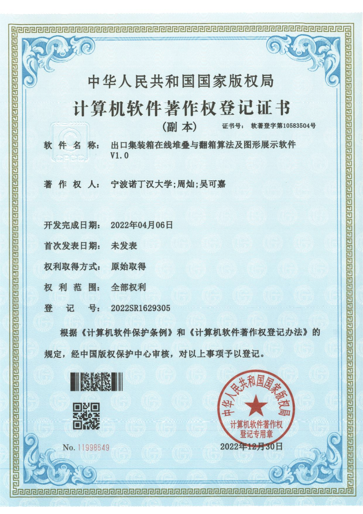

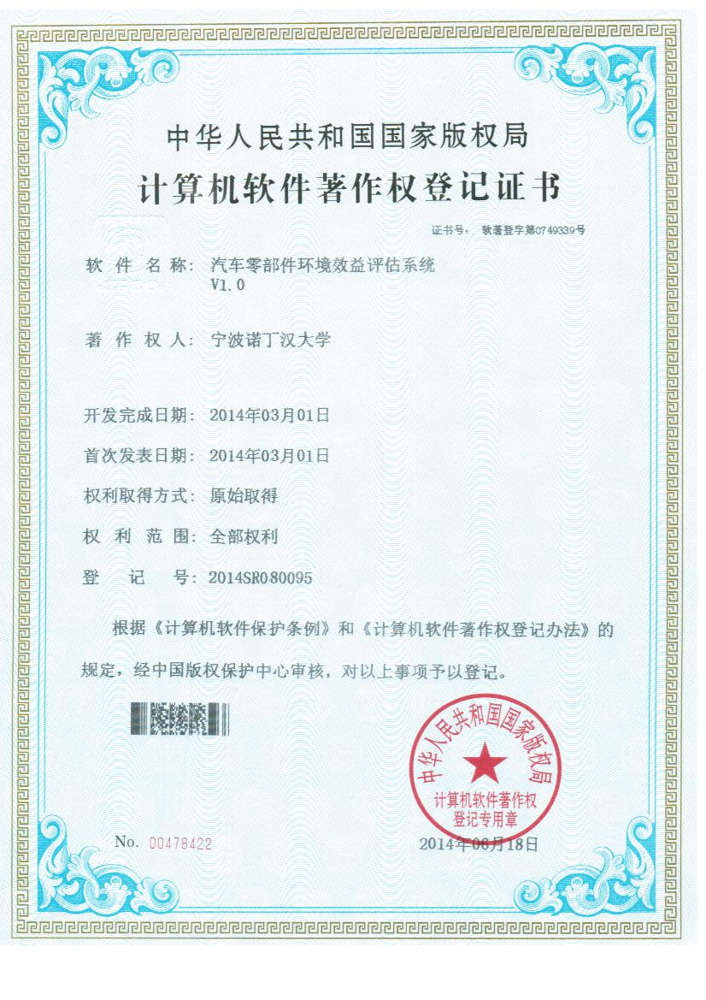

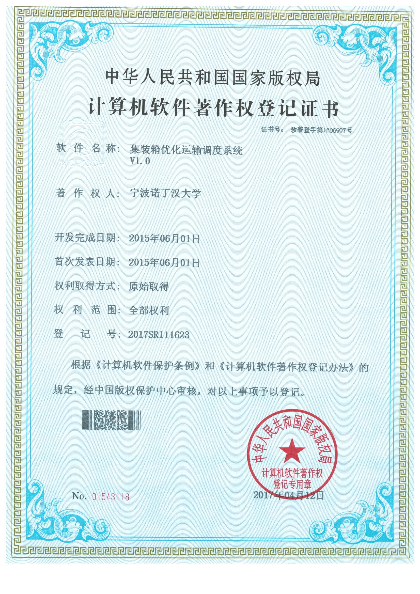

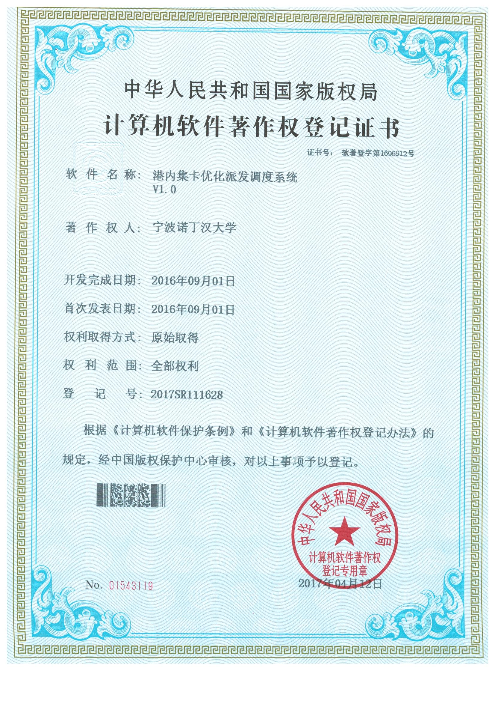

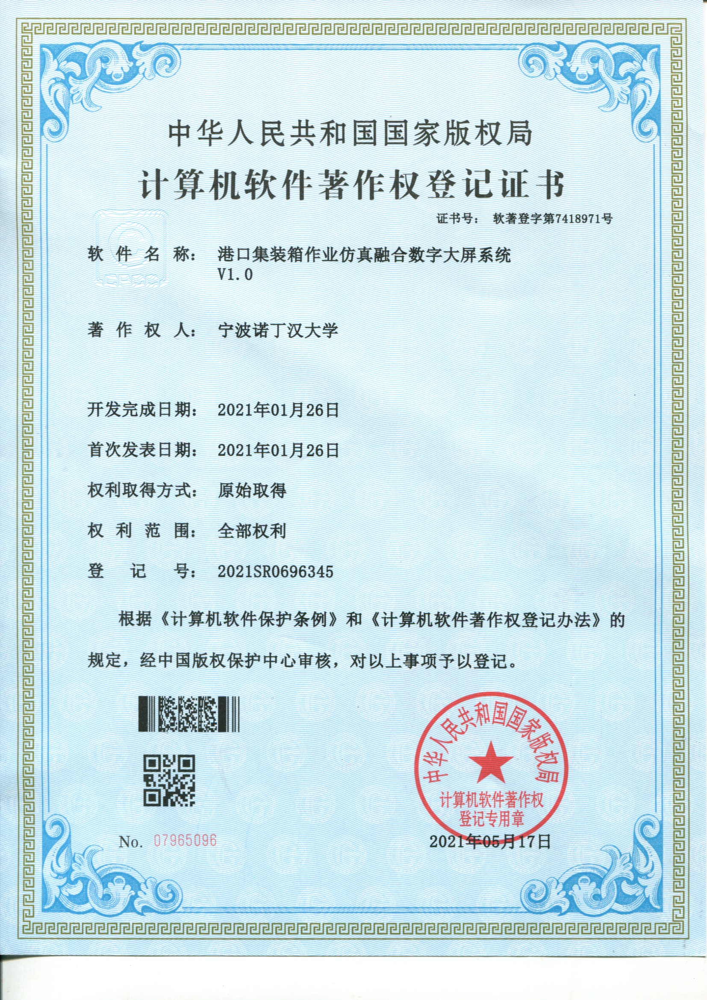

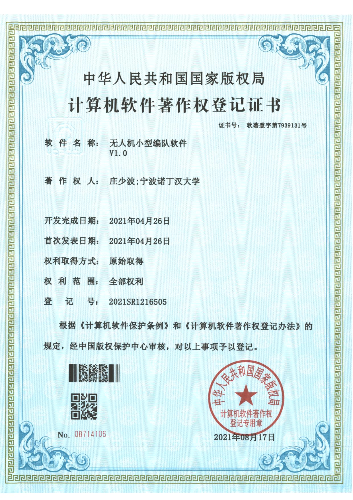

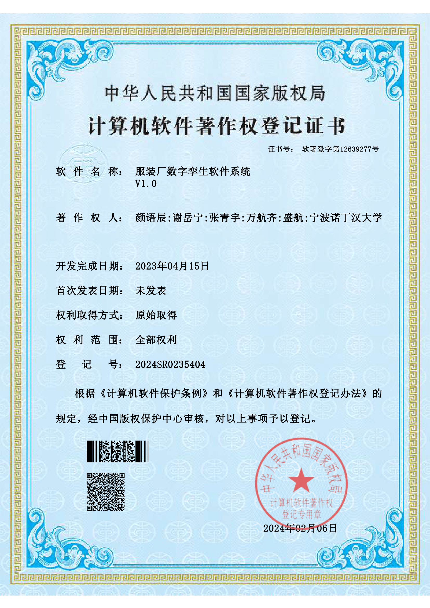

## 奖项 Awards

### 华为火花奖 Huawei Spark Award

作为华为顾问的实验室主任白瑞斌教授，解决华为军团挑战第二期难题"集装箱码头泊位和岸桥分配优化"，获得华为火花奖。

> Professor Ruibin Bai won the Huawei Spark Award for solving the Huawei Corps Challenge Phase II problem.

### 中国工业互联网大赛最佳技术创新奖

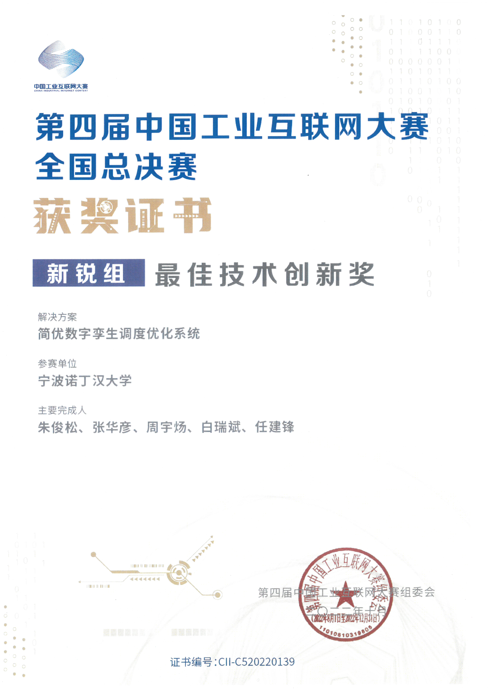

- 实验室研发的 **Simplex AI 调度优化系统**在第四届中国工业互联网大赛总决赛中获得**最佳技术创新奖**。
- 实验室研发的 **EPortSim-AI**（电气化港口物流-能源流一体化仿真 AI 智能体）在第三届全国人工智能应用场景创新挑战赛获得**总决赛一等奖**。

> The Simplex AI scheduling optimisation system won the Best Technical Innovation Award in the finals of the 4th China Industrial Internet Competition. The EPortSim-AI agent—an AI-powered simulation tool that integrates electrical port logistics with energy flows—won first prize in the finals of the 3rd China's Innovation Challenge on Artificial Intelligence Application Scene.

### MICCAI 脑肿瘤分割 / 图像修复全球冠军

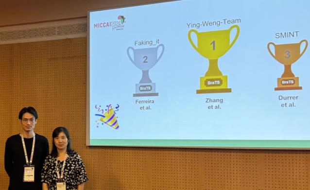
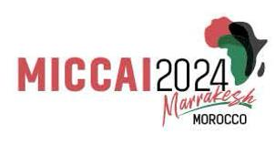

计算机人工智能专业主任翁莹带领的博士生团队，在第 27 届国际医学图像计算与计算机辅助干预会议（MICCAI）的脑肿瘤分割挑战赛、国际脑肿瘤图像修复赛中卫冕全球冠军。

> A team of PhD students led by Ying Weng, Director of Computer Artificial Intelligence, defended their global title in the Brain Tumour Segmentation Challenge and International Brain Tumour Image Restoration Competition at the 27th MICCAI.

### IEEE ISBI 2026 超声图像分析挑战赛冠军

计算机系何祥健教授带领团队在 2026 年国际生物医学成像会议（ISBI）的超声影像基础模型挑战赛上获得冠军。

> Prof. He Xiangjian (Dept. of Computer Science) led his team to claim the title in the Ultrasound Image Analysis Foundation Model Challenge at ISBI 2026.
