# 成果介绍 · 论文发表 Publications

[← 返回总目录](../README.md) · [← 专利、软著与奖项](patents-software-copyrights.md)

实验室在多项国际顶级会议以及期刊中发表了大量成果。

## 国际会议 International Conferences

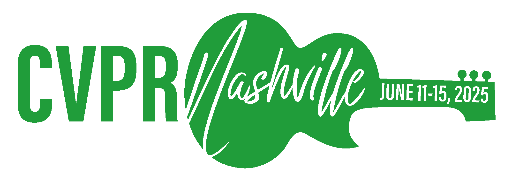
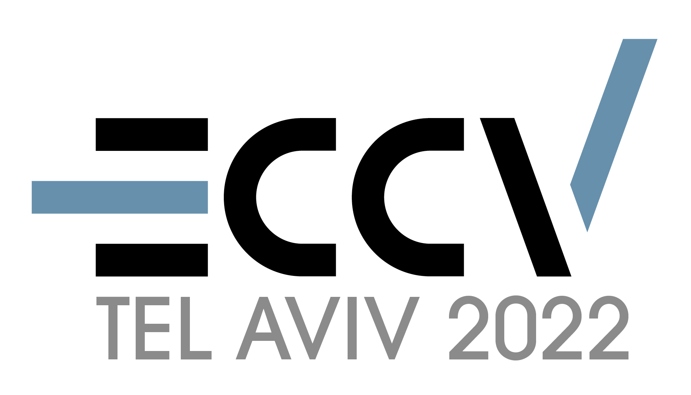
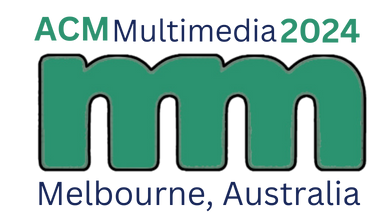
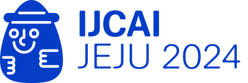

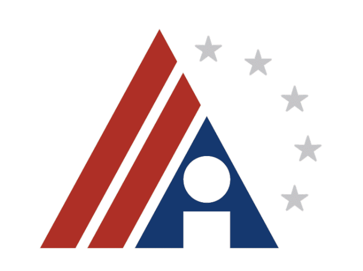
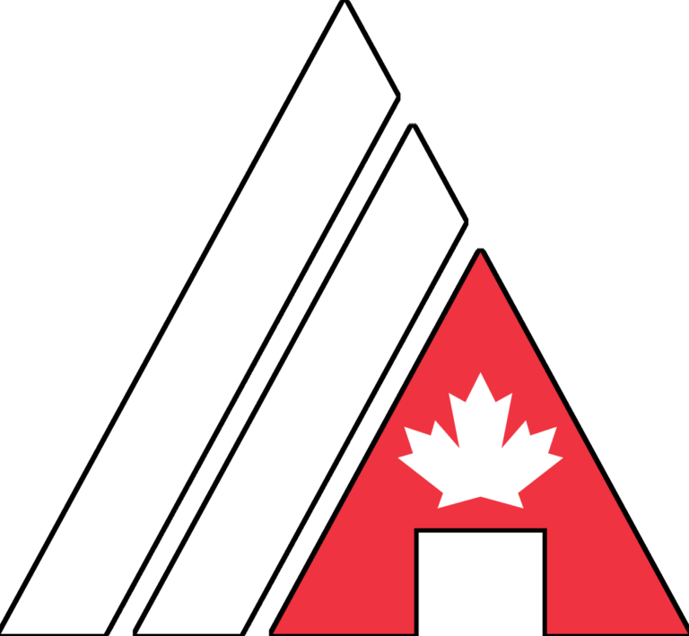
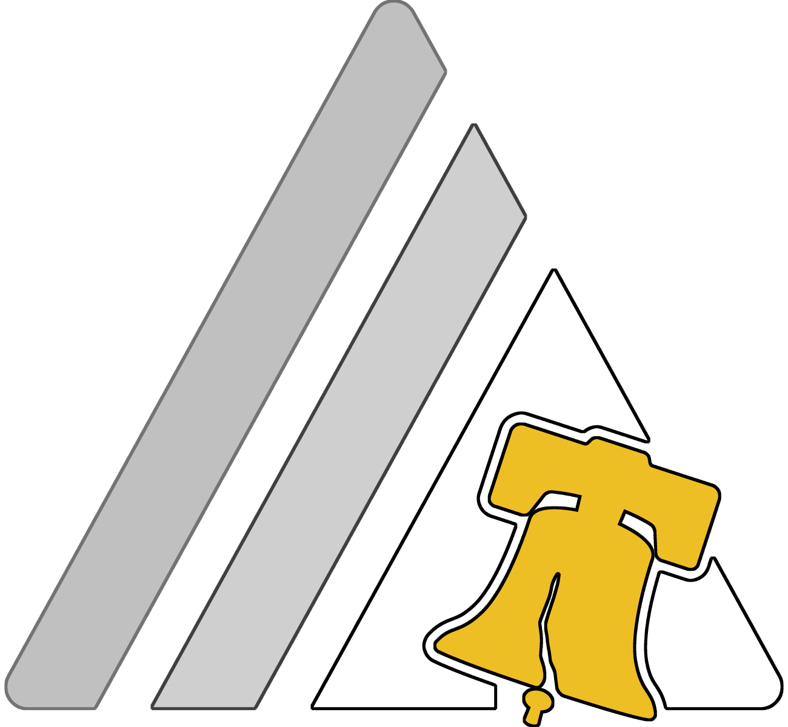

## 国际期刊 International Journals

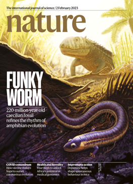
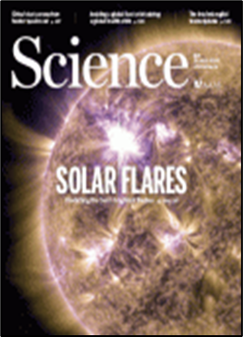
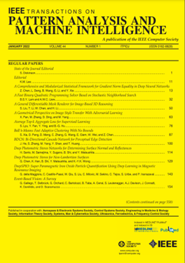
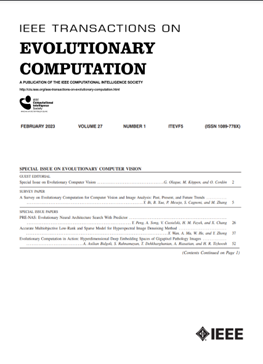
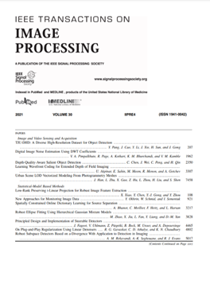
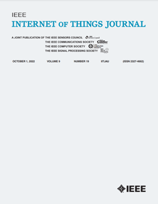
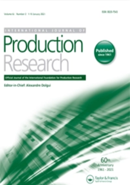
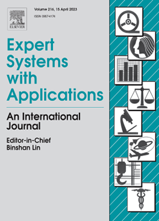
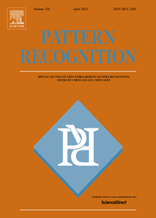
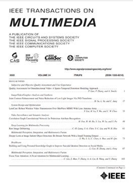
