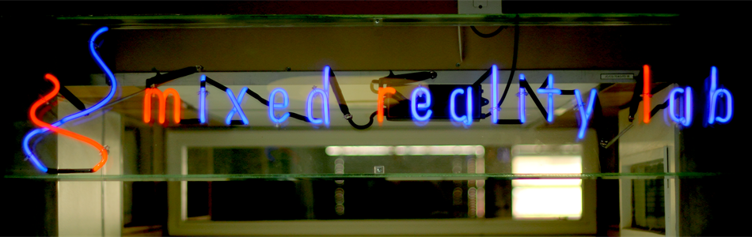
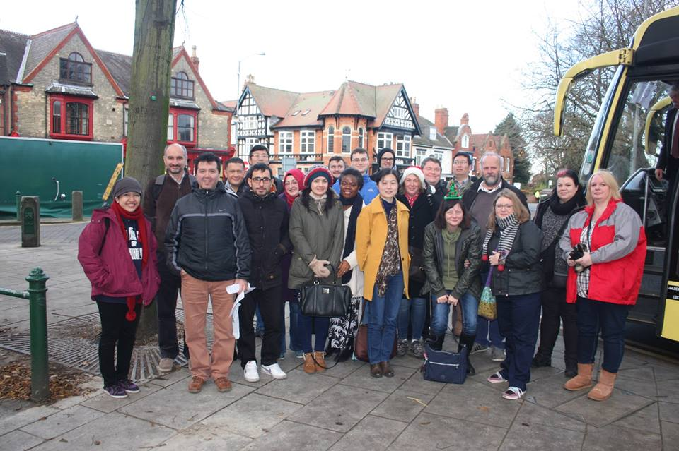
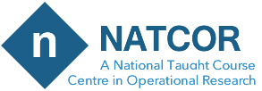
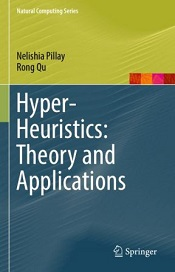
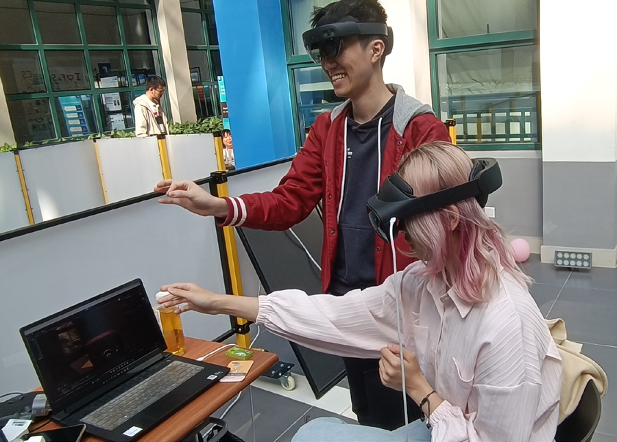
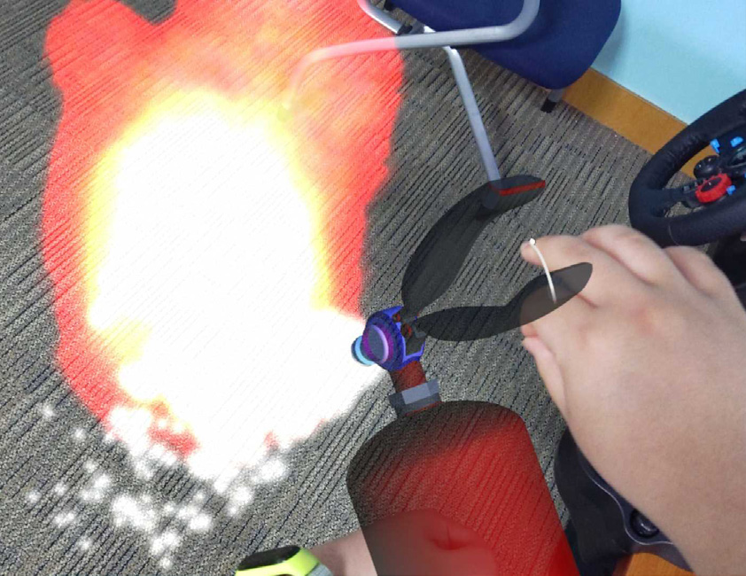
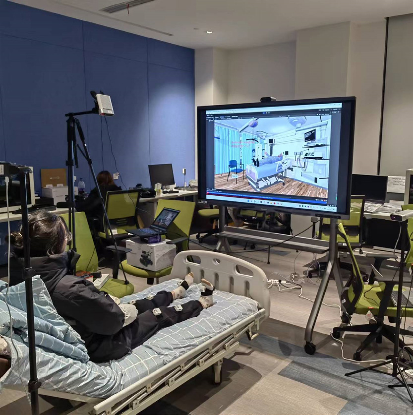
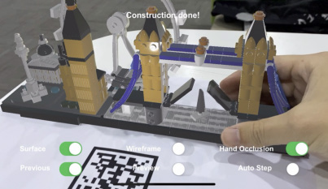
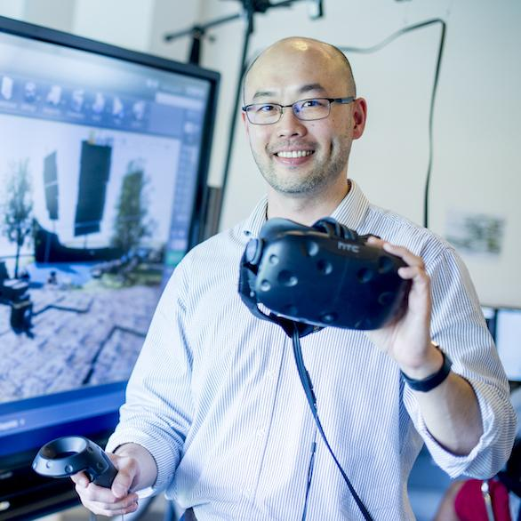

# 联合单位介绍 Cooperation Partners

[← 返回总目录](../README.md)

## 混合现实实验室 Mixed Reality Lab (MRL)

混合现实实验室（Mixed Reality Lab, MRL）是一个成立于 1999 年的跨学科小组，主要探索简易方便的可交互式技术改变日常生活的潜力。MRL 团队将跨学科方法（社会科学、人文学科）与学科内方法（分布式系统、人工智能和机器学习、视觉方法）相结合，开发新颖的数字化技术。MRL 与包括 BBC、谷歌、微软研究院、联合利华、BAE、通用航空、诺基亚、英国电信、索尼和苏格兰电力在内的各种工业合作伙伴合作，拥有千万英镑级项目经费。

> The Mixed Reality Lab (MRL) was established in 1999, and is an interdisciplinary group exploring the potential of ubiquitous, mobile and interactive technologies to shape everyday life. The MRL team combine an interdisciplinary approach (linking to the Social Sciences and Humanities) with an intra-disciplinary approach (with areas such as Distributed Systems, AI and Machine Learning, Vision and Formal Methods) to enable an end-to-end methodology in which they both develop novel digital technologies and understand that 'in the wild'. The MRL has collaborated with and received research funding from a variety of industrial partners including the BBC, Google, Microsoft Research, Unilever, BAE, GE Aviation, Nokia, BT, Sony, and Scottish Power, with research funding worth tens of millions of pounds.

---

## 诺丁汉大学 ASAP / COL 实验室

诺丁汉大学 ASAP（后改为 COL）是国际知名的智能计算与调度优化实验室，曾是国际 SCI 期刊 *Journal of Scheduling* 多年的主编单位，也是两个国际非常有影响力的学术会议（PATAT 和 MISTA）的发起单位，先后与英国希思罗机场、曼彻斯特机场、荷兰航空（KLM）等大型企业建立了作业调度与核心资源配置优化的科研合作。团队多年从事运筹优化与智能决策方面的理论研究、关键算法创新以及实践应用。

> ASAP (later renamed as COL) of the University of Nottingham UK is an internationally renowned intelligent computing and scheduling optimization lab. It was the editor-in-chief of the international SCI Journal of Scheduling for many years, and the initiator of two very influential international academic conferences (PATAT and MISTA). The unit has successively established scientific research cooperation with large enterprises such as Heathrow Airport, Manchester Airport, KLM on job scheduling and core resource allocation optimization. The team has been engaged in theoretical research, key algorithm innovation and practical application in operational research optimization and intelligent decision-making for many years.

*COL 实验室人员合影*

*COL 与其他大学联合开设的课程*

*出版书目*

---

## 人机交互实验室 Human-Computer Interaction Laboratory

人机交互实验室成立于 2021 年，致力于探索人机交互领域的前沿研究，旨在通过创新技术推动该领域的发展，拓展研究方向，开发新的技术应用。实验室与国内外科研机构和企业建立了紧密的合作关系，开展跨国科研项目，促进人机交互领域的国际交流与合作，并推动人机交互技术在医疗、教育、工业、娱乐等领域的应用。研究方向主要集中在人机交互和相关技术的结合，包括人工智能、智能现实、智能感知、物联网技术等。实验室在医疗和教育等领域开展了前沿研究，涵盖传感器融合与惯性导航、人机交互与扩展现实技术、物联网与智能感知、数据分析与模式识别等主要方向。

> The Human-Computer Interaction Laboratory, established in 2021, is dedicated to exploring cutting-edge research in HCI, aiming to promote the development of the field through innovative technologies, expanding research directions, and developing new technological applications. The lab has established close partnerships with domestic and international research institutes and enterprises. The research direction focuses on the combination of HCI and related technologies, including AI, intelligent reality, intelligent perception, and IoT. The lab has carried out cutting-edge research in healthcare and education, covering sensor fusion and inertial navigation, HCI and extended reality, IoT and intelligent perception, data analysis and pattern recognition.

---

## 宁波诺丁汉大学-英伟达混合现实联合实验室（补充）

宁波诺丁汉大学-英伟达混合现实联合实验室由宁波诺丁汉大学与全球科技领军企业英伟达（NVIDIA）共建。该实验室依托计算机科学学院，由庄以仁博士担任主任，整合英伟达全球领先的 GPU 加速计算与可视化技术，聚焦人工智能、混合现实、复杂系统模拟等前沿领域。实验室核心科研项目包括考古重建计划、遗址数字化、社交网络大数据分析等创新方向，同时为博士生与计算机专业学生提供 NVIDIA 技术认证与产业实践平台。通过产学研深度协同，实验室致力于推动虚拟现实、深度学习等技术的工业级应用转化，构建跨学科科研生态体系。

> The UNNC-NVIDIA Mixed Reality Joint Laboratory is jointly established by the University of Nottingham Ningbo China and NVIDIA, a global technology leader. Relying on the School of Computer Science, and with Dr Eren Chuang as the director, the lab integrates NVIDIA's world-leading GPU-accelerated computing and visualisation technologies, focusing on cutting-edge areas such as artificial intelligence, mixed reality, and complex system simulation. The core research projects include archaeological reconstruction, site digitisation, social network big data analysis, and provides PhD and computer science students with a platform for NVIDIA technology certification and industrial practice.

