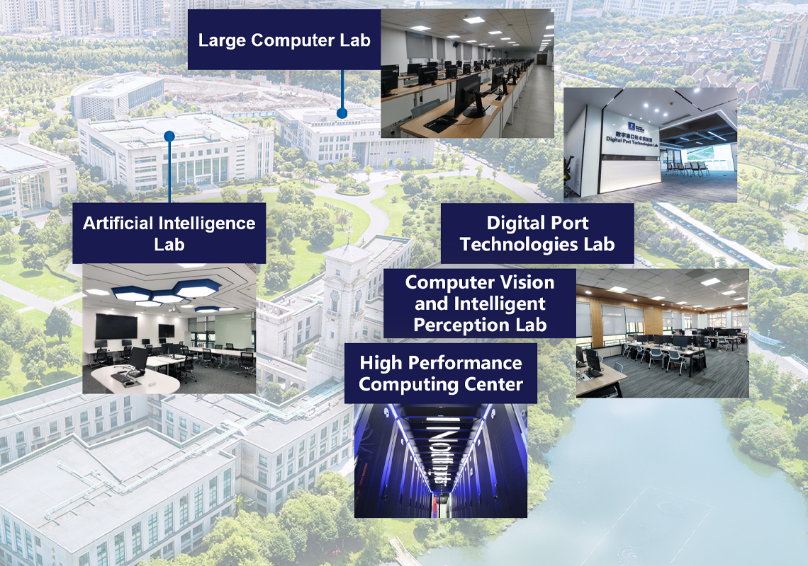
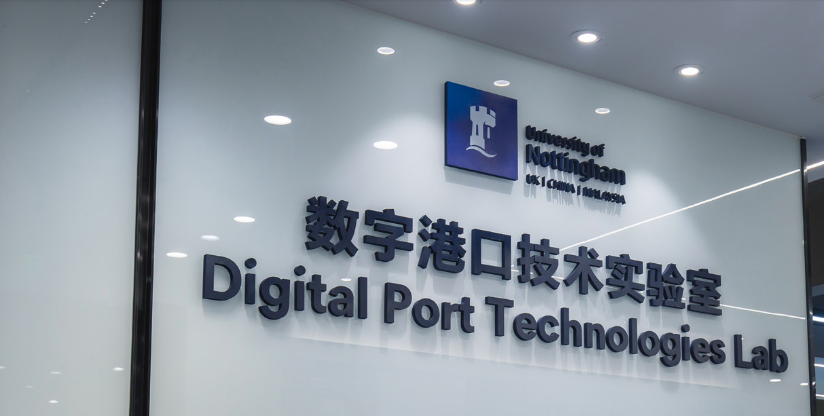
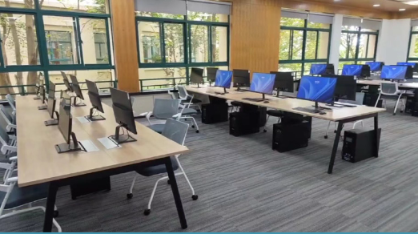
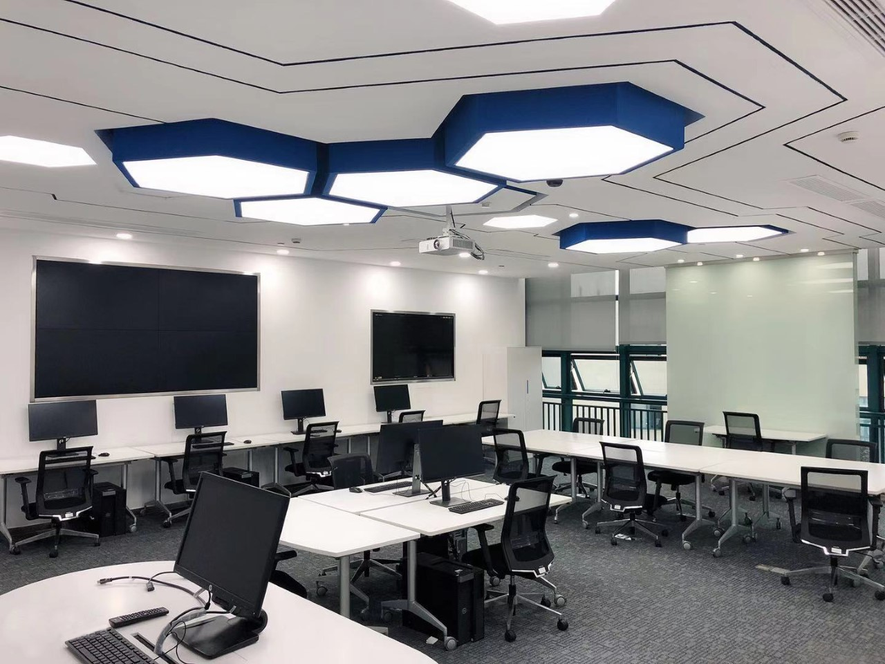

# 科研场地 Research Space

[← 返回总目录](../README.md)

科研场地总面积 **3049 平方米** / Research Space in total **3049 m²**。

## 各实验室场地

- **数字港口技术实验室**：场地面积约 337 平米，主要用于 5G、数字孪生、无人车 AGV 调度研究等。
  > The Digital Port Technology Laboratory covers an area of approximately 337 m², primarily dedicated to research in 5G, digital twins, and unmanned vehicle AGV scheduling.

- **人工智能实验室**：场地面积约 90 平米，配备高性能 AI 工作站，用于机器学习、机器视觉、自然语言处理等项目研究。
  > The Artificial Intelligence Laboratory covers approximately 90 m², equipped with high-performance AI workstations for machine learning, computer vision, natural language processing, and more.

- **高性能计算中心（兼中心机房）**：210 平米，放置 HPC 超级计算机，提供远程运算服务。
  > The High-Performance Computing Center, which also serves as the central equipment room, spans 210 m² and houses HPC supercomputers to provide remote computing services.

- **计算机视觉与感知实验室**：约 240 平米，主要用于 AI 视觉追踪系统、动作捕捉的研究。
  > The Computer Vision and Perception Laboratory, approximately 240 m², is mainly dedicated to AI visual tracking systems and motion capture.

- **教学科研机房**：面积共 996 平米，主要用于教学科研服务。
  > Teaching and Research Computer Rooms total 996 m², primarily serving educational and scientific research purposes.

- **科学研究培训实验室**：面积约 1077 平米，用于研究生科研培训场所，主要涉及人工智能算法与应用方面的研究。
  > The Scientific Research Training Laboratory covers approximately 1077 m², serving as a venue for postgraduate research training, with a focus on AI algorithms and applications.

> 此外，实验室还设有英伟达虚拟现实实验室、人机交互实验室等专项研究空间（详见[联合单位介绍](../05-cooperation-partners/cooperation-partners.md)）。

## 实验室平面与实景

*实验室地图*

