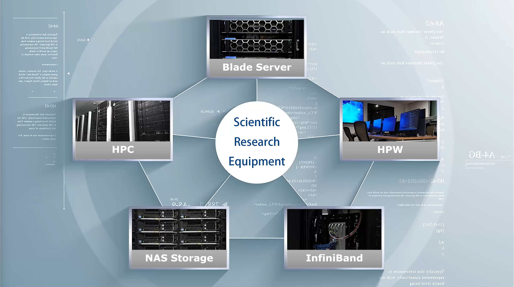
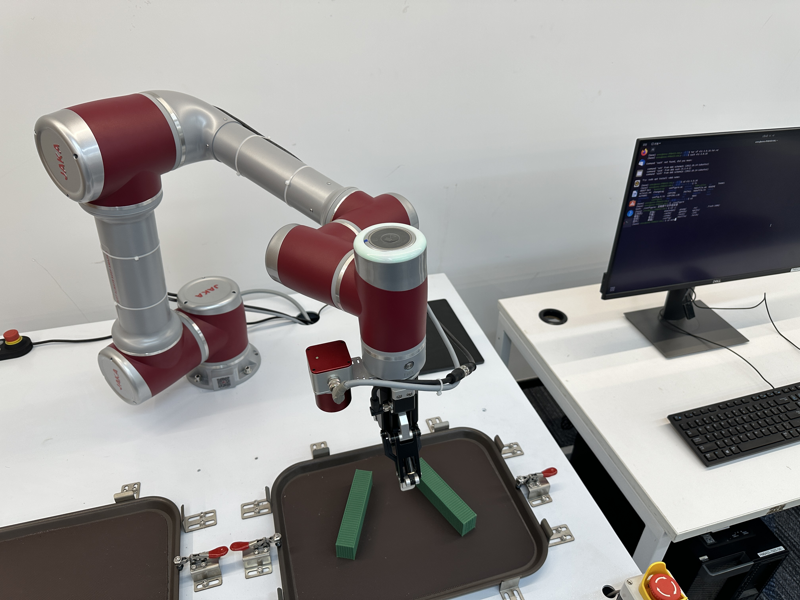
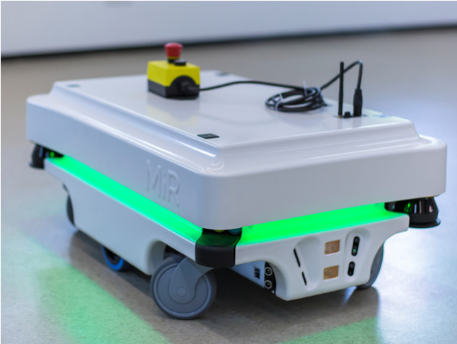
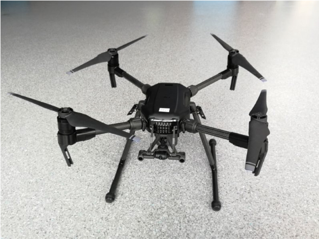
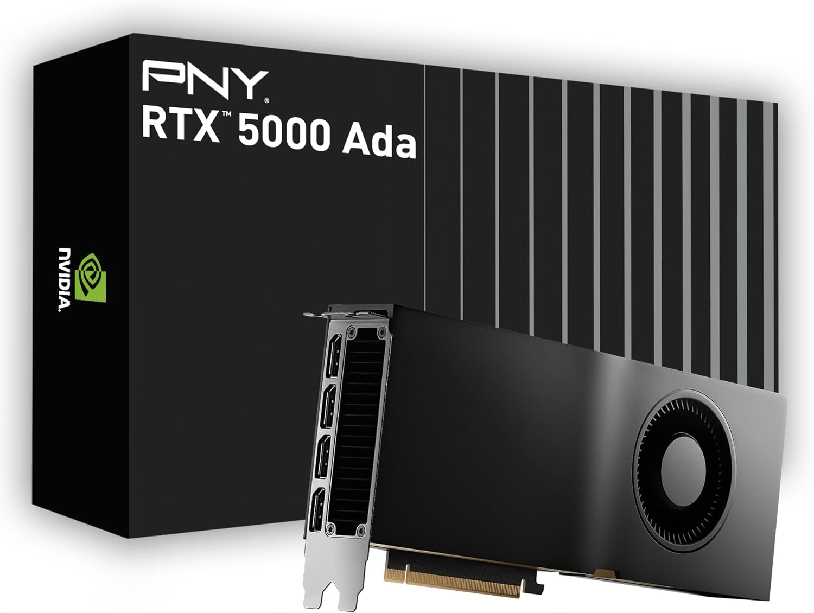
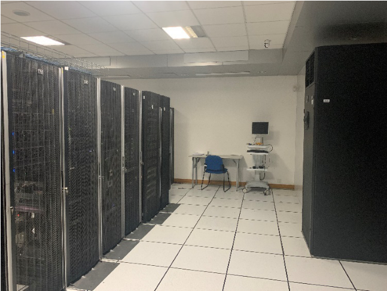
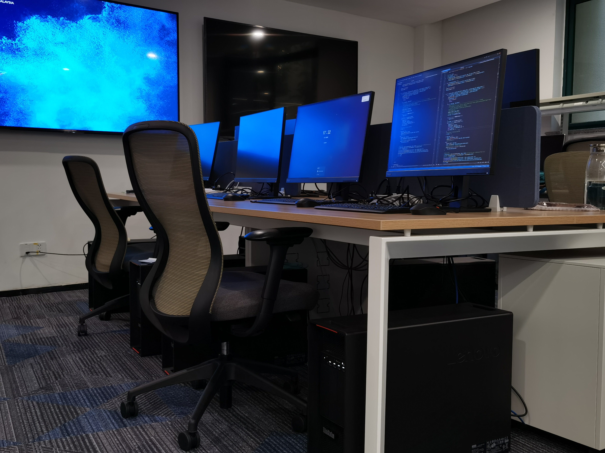
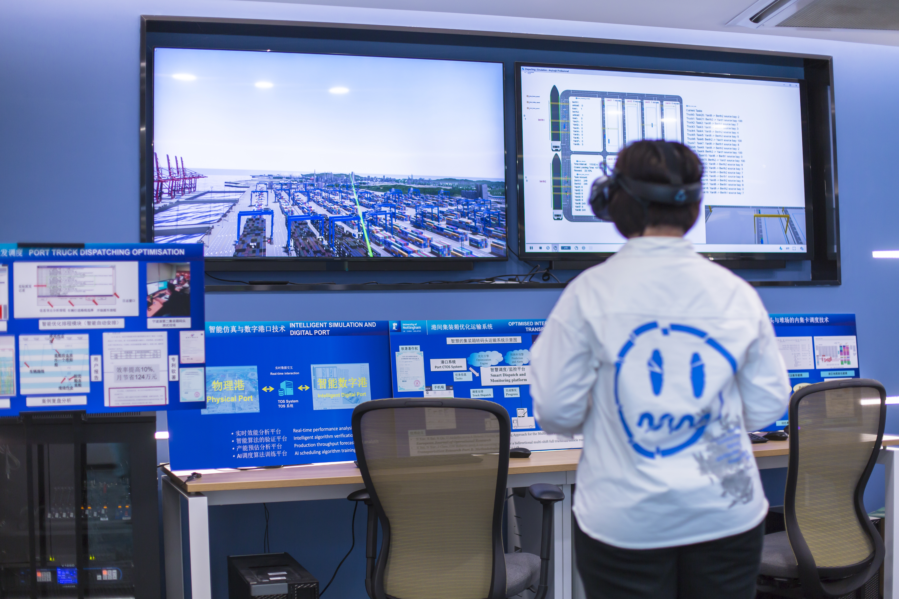
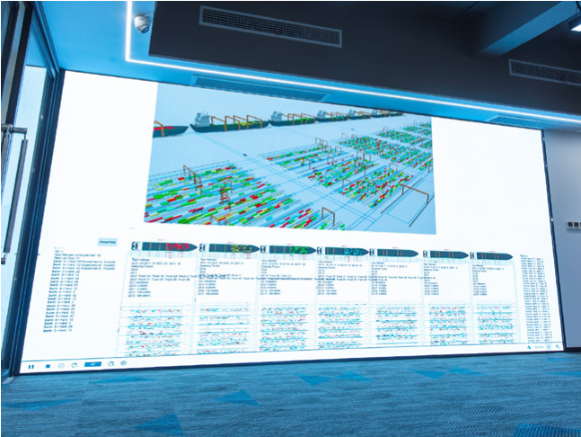
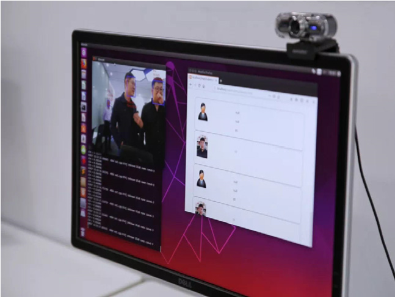

# 科研仪器 Research Equipment

[← 返回总目录](../README.md)

实验室拥有各类个人电脑、服务器、图形工作站等软硬件 **463 台（套）**，总价值约 **3338 万元**，另有相关专业软件 8 套。

> The laboratory has 463 sets of software and hardware of various PCs, servers, graphics workstations, etc., with a total value of about 33.38 million RMB, plus 8 sets of professional software.

**算力资源**：实验室拥有 A100（80G）、A6000（48G）、A5880（48G）、RTX5000 ADA（32G）、A5000（24G）等最新算力资源；可访问 V100 超算集群，并增添了新的 **H200 八卡集群**、**24 卡 L20 集群**和 **8 卡 H20 集群**。

> The lab has the newest computing units such as A100 (80G), A6000 (48G), A5880 (48G), RTX5000 ADA (32G), A5000 (24G), etc. The lab has access to the V100 supercomputing cluster and has added new clusters, including an 8-card H200 cluster, a 24-card L20 cluster, and an 8-card H20 cluster.

## 主要设备

主要设备包括：机械臂、H200 集群、AI 计算卡、虚拟现实设备、AGV 导引车、超算中心、智慧 4K 大屏、M200 无人机、工作站、目标检测系统等。

*机械臂*

*AGV 导引车*

*M200 无人机*

*RTX5000 ADA*

*超算中心*

*工作站*

*虚拟现实设备*

*智慧 4K 大屏*

*目标检测系统*
