# 实验室对外交流与合作 · 学术会议 Academic Conferences

[← 返回总目录](../README.md) · [开放基金 →](open-fund.md)

## 举办会议 Hosting Conferences

### 信息资源管理国际会议 Conf-IRM 2018（宁波）

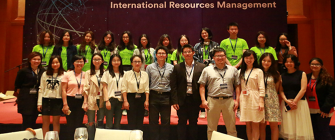

*International Conference on Information Resources Management (Conf-IRM), 2018, Ningbo*

2018 年的信息资源管理国际学术会议由宁波诺丁汉大学举办，该会议是当前信息系统领域最顶级的全球纯学术专业组织信息系统协会（AIS）的一个附属会议。来自 10 多个国家的 100 余名学者出席了本次会议，主要讨论了通过数字化转换应对全球变化等问题。

> The 2018 International Academic Conference on Information Resource Management, hosted by the University of Nottingham Ningbo, is an affiliated conference of the Association for Information Systems (AIS), currently the top global purely academic professional organization in the field of information systems. More than 100 scholars from more than 10 countries attended the conference, which focused on issues such as responding to global change through digital transformation.

### 多学科国际调度与排序会议 MISTA 2019（宁波）

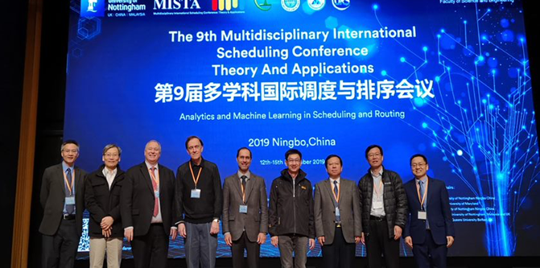
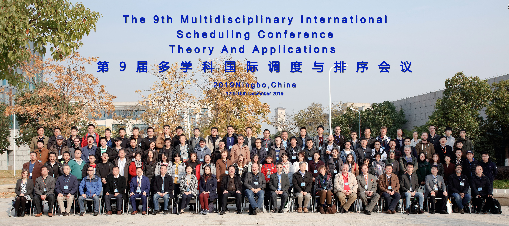

*Multidisciplinary International Scheduling Conference Theory And Applications (MISTA), 2019, Ningbo*

多学科国际调度与排序会议由诺丁汉大学创立，是两年一度汇聚全球调度与优化研究者的国际研究大会。2019 年第九届 MISTA 会议宁波诺丁汉大学主办，来自 18 个国家与地区近 200 名专家学者参与。

> Multidisciplinary International Scheduling Conference Theory And Applications (MISTA), founded by the University of Nottingham, is a biannual international research conference that brings together researchers from all over the world in the field of scheduling and optimisation. In 2019 the University of Nottingham Ningbo China hosted the 9th MISTA conference. More than 200 scholars from 18 countries and regions attended the conference.

### 2020 年人工智能产业年会 · 工业互联网与智能制造专题论坛

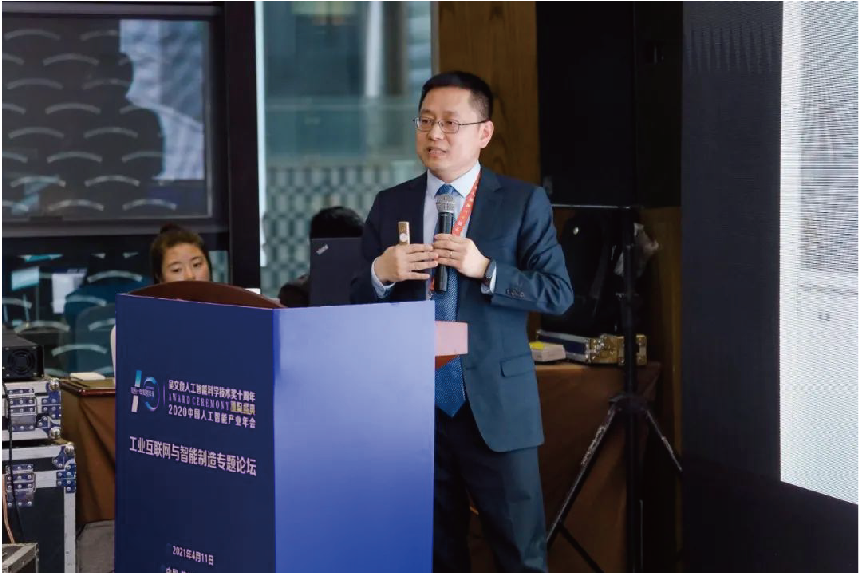

*2020 Artificial Intelligence Industry Annual Conference, Special Forum on Industrial Internet and Intelligent Manufacturing*

实验室主任白瑞斌教授受邀主持专题论坛。本次论坛旨在探索工业互联网助力智能制造的发展前景，探索工业互联网未来发展路径。

> Professor Ruibin Bai, Director of the Laboratory, was invited to preside over the forum, which aimed to explore the development prospects of industrial Internet to help intelligent manufacturing and the future development path of industrial Internet.

### 国际计算智能基础与应用研讨会 FACI 2025（宁波）

2025 年 6 月 20 日至 22 日，国际计算智能基础与应用研讨会（FACI 2025）在宁波诺丁汉大学成功举办，会议由宁波诺丁汉大学执行校长 Jon Garibaldi 教授担任大会主席，何祥健、白瑞斌等教授主持。大会汇聚来自香港岭南大学、西湖大学、香港城市大学、香港理工大学、南洋理工大学、马斯特里赫特大学、重庆大学、浙江大学、郑州大学、西安交通大学、深圳大学、电子科技大学、厦门大学等在计算智能领域具有重要影响力的 15 位专家学者，以及来自海内外的 200 余位与会代表，围绕计算智能的核心理论、最新技术和未来应用展开深入交流。

### 第六届国际视频、信号与图像处理会议 VSIP 2024 / 第六届国际计算机视觉、图像与深度学习学术大会 CVIDL 2025

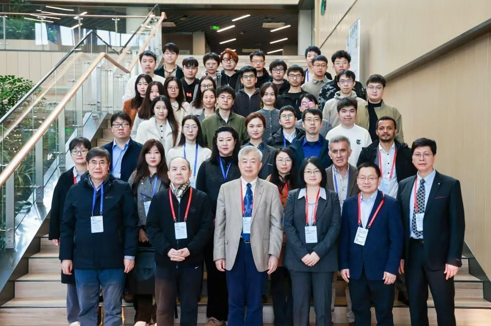

*The 6th International Conference on Video, Signal and Image Processing (VSIP 2024) · The 6th International Conference on Computer Vision, Image and Deep Learning (CVIDL 2025)*

依托实验室平台，何祥健、白瑞斌教授及副校长邱国平教授等牵头承办并主持。会议采用线上线下融合模式，吸引数百位国内外专家学者参会，围绕计算机视觉、图像处理、信号分析与深度学习等前沿领域开展深入研讨。

### 2025 人工智能与智能决策研讨会暨学术委员会会议

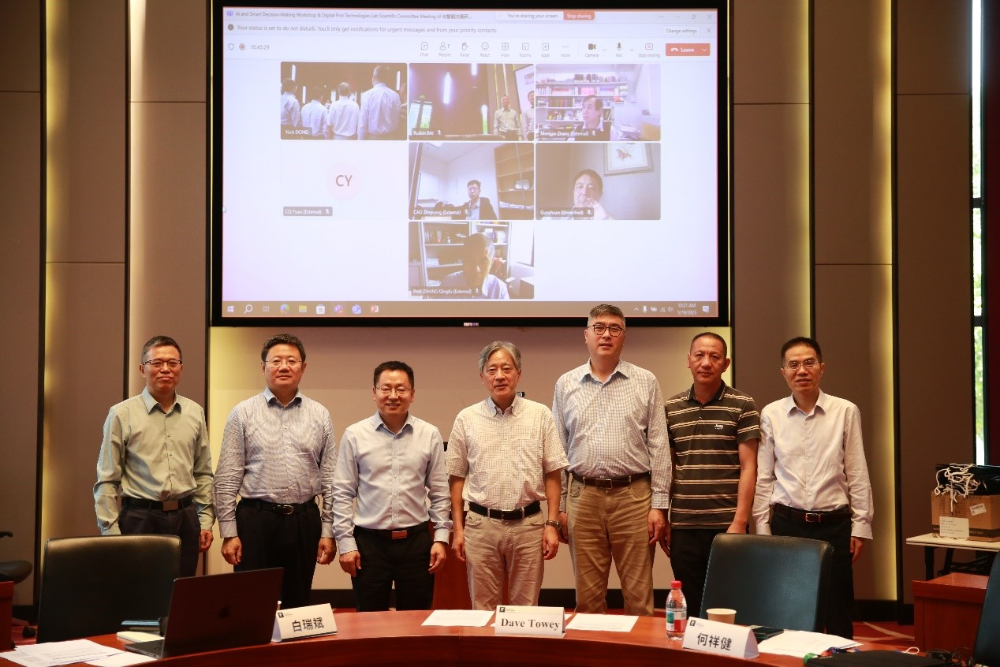

*Group photo of UNNC AI and Smart Decision-Making Workshop and Academic Committee Meeting of the Key Laboratory for Digital Port Technologies, 2025*

本次会议的成功召开，为人工智能与数字港口技术的跨学科创新搭建了高端交流平台，协助数字港口技术重点实验室学术委员会高效发挥学术引领、决策咨询、产业赋能的作用。

> The successful convening of this conference established a high-end exchange platform for interdisciplinary innovation in AI and digital port technology, assisting the Academic Committee in efficiently fulfilling its roles in academic leadership, decision-making consultation, and industry empowerment.

## 参与会议 Attending Conferences

### IEEE 计算智能世界大会 WCCI 2024（横滨）

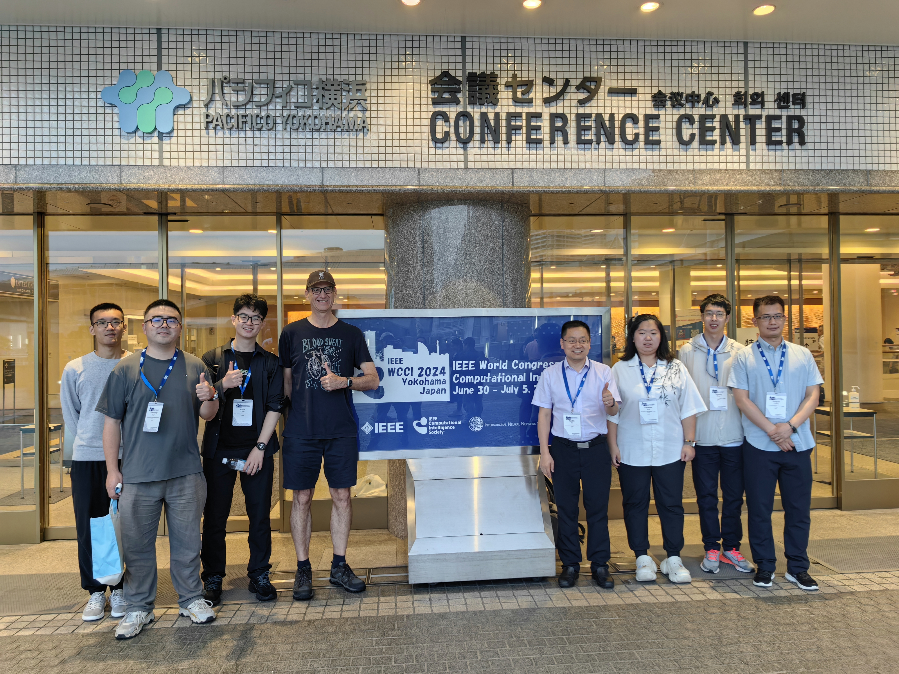

*The IEEE World Congress on Computational Intelligence (WCCI 2024), Yokohama, July 14–19, 2024*

### 信息系统国际会议 ICIS 2019（慕尼黑）

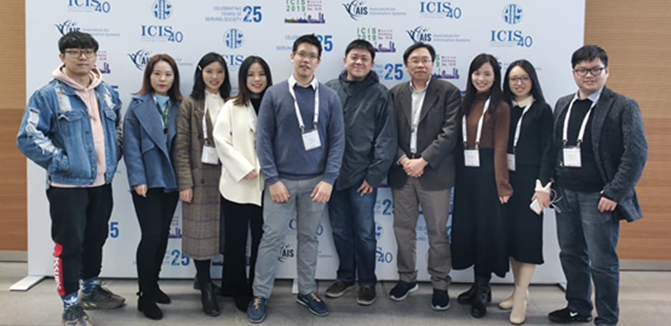

*International Conference on Information Systems (ICIS), 2019, Munich*

### 粤港澳大湾区大数据与人工智能大会 2024

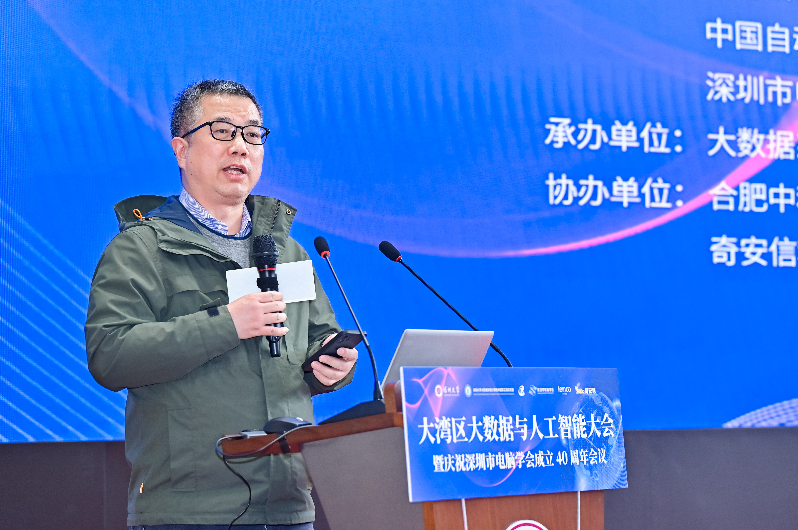
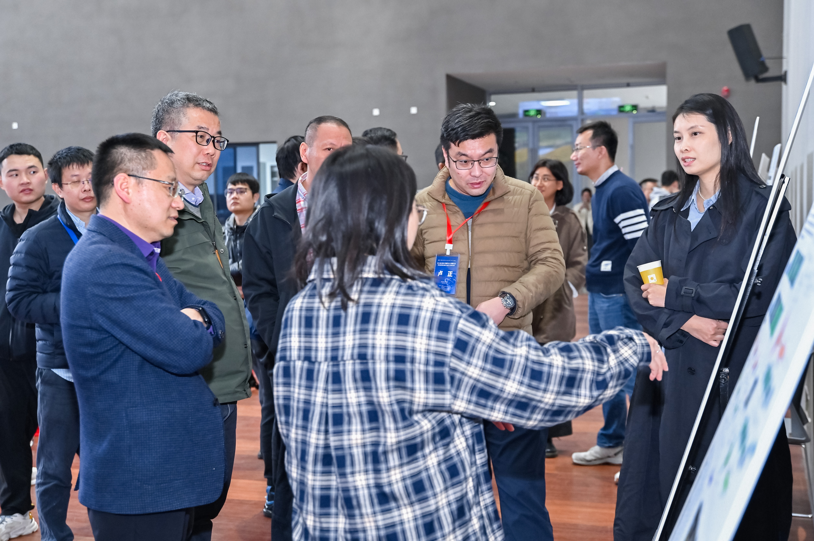
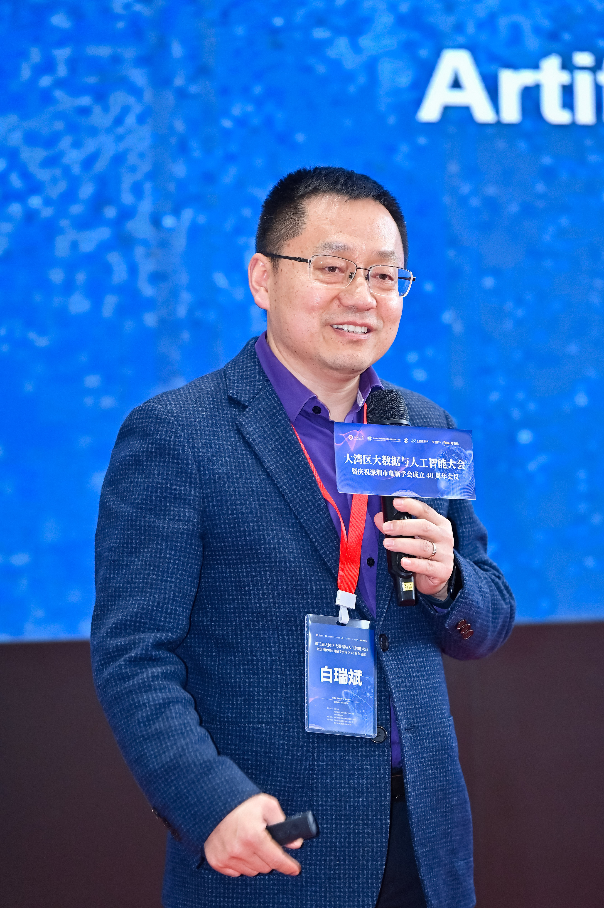

*Big Data and Artificial Intelligence Conference for the Greater Bay Area, 2024*

白瑞斌、任剑锋教授受邀做学术报告。

> Professor Ruibin Bai and Jianfeng Ren were invited to give academic presentations at the conference.

### 2024 宁诺—中科院深圳先进技术研究院交流研讨会

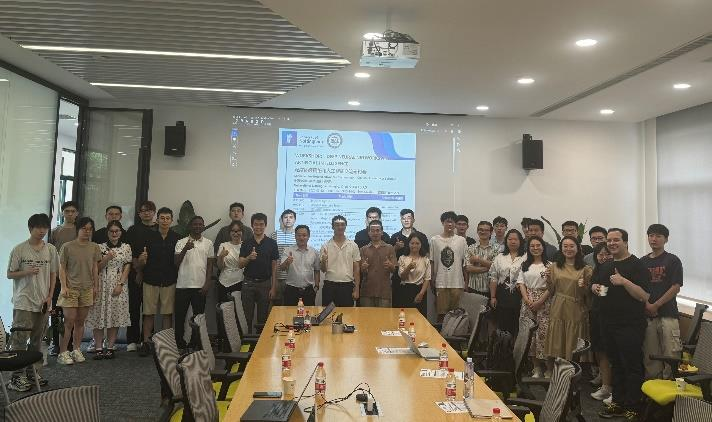

*Group photo of UNNC–Shenzhen Institute of Advanced Technology, Chinese Academy of Sciences (SIAT) exchange seminar, 2024*

在 DTP 博士交换项目的支持下，为双方的博士生和科研人员提供了宝贵的交流机会，促进了不同学术背景和研究方向的碰撞与融合。

> With the support of the DTP doctoral exchange program, this event provided valuable communication opportunities for doctoral students and researchers from both sides.

### 2023 宁波智博会

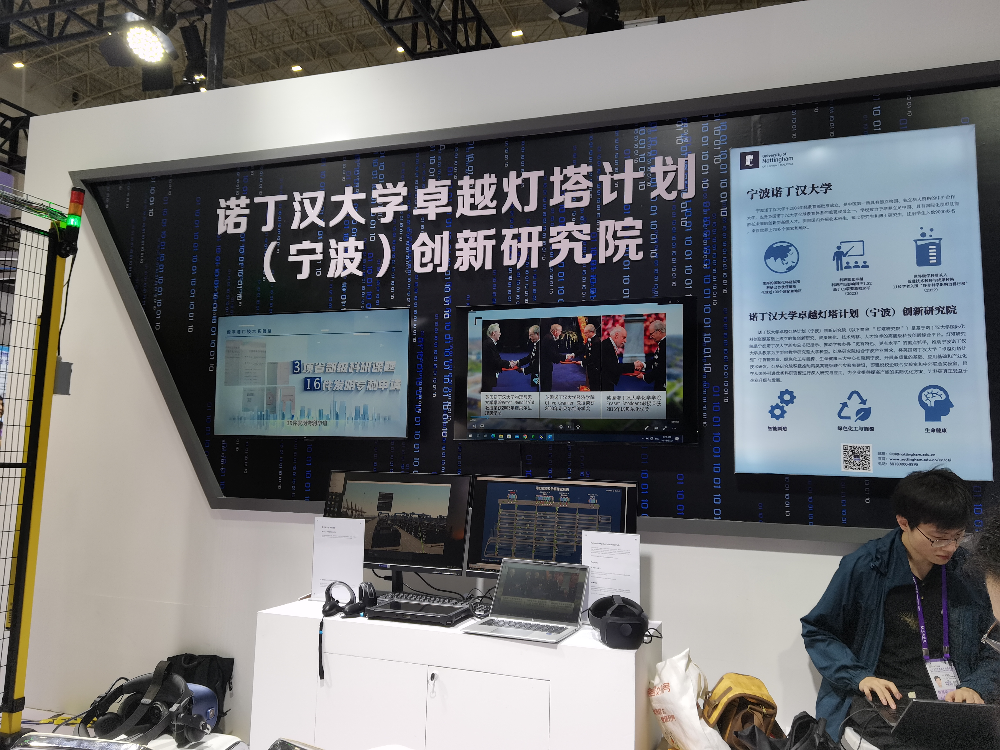
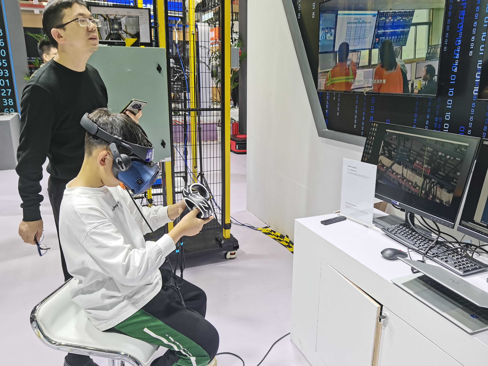

2023 年实验室代表灯塔研究院参展宁波智博会展台。

> In 2023, the laboratory represented China Beacon Research Institute to participate in the Ningbo Smart Expo booth.

### IEEE 人工智能会议 CAI 2024（新加坡）

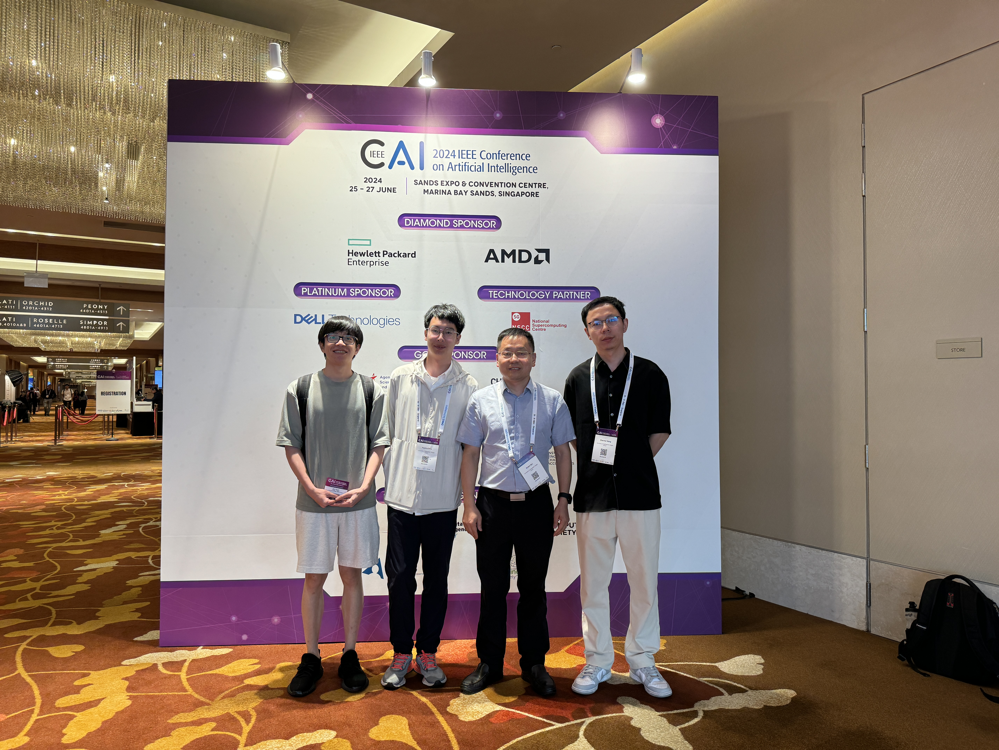

*The IEEE Conference on Artificial Intelligence (CAI 2024), Singapore, June 4–6, 2024*

### ACM 多媒体 ACMMM 2024（墨尔本）

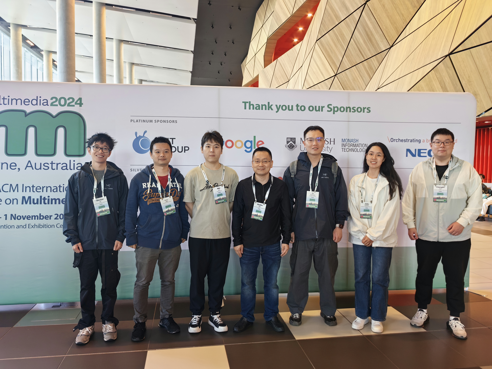

*The ACM Multimedia (ACMMM), 2024, Melbourne*
