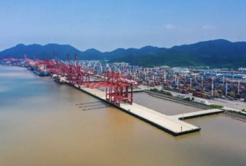
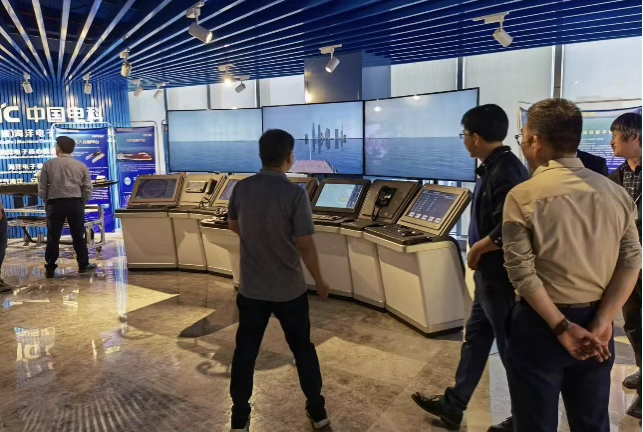
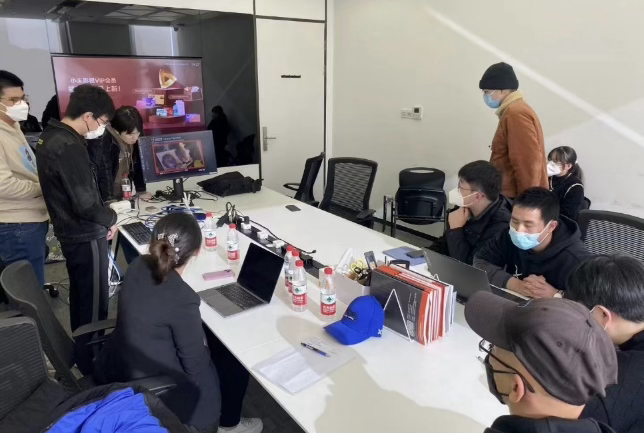
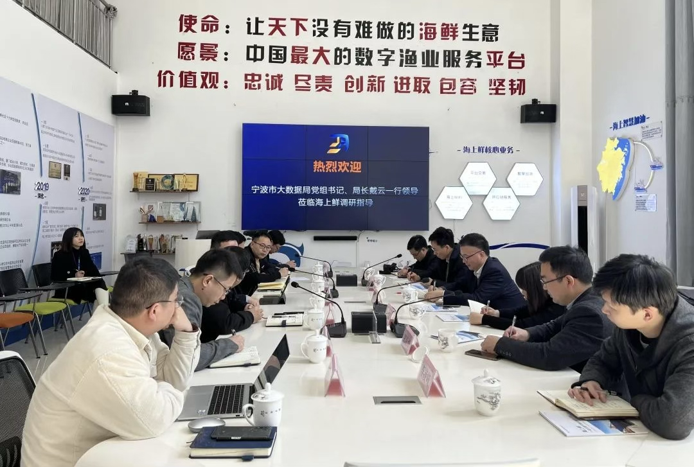
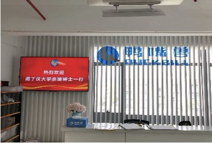
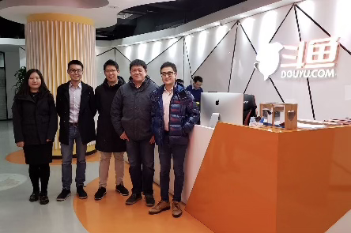
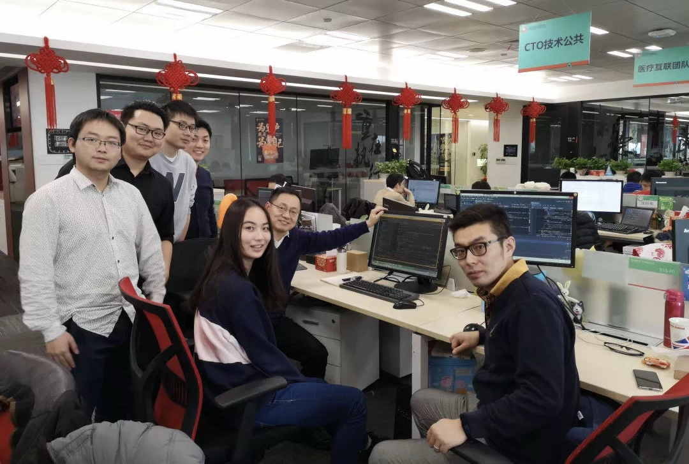
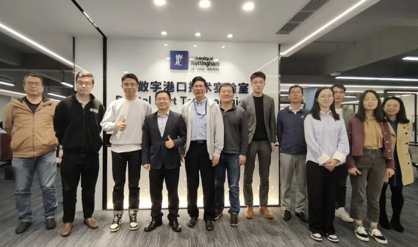

# 实验室对外交流与合作 · 产学研合作 Industry-University-Research Cooperation

[← 返回总目录](../README.md) · [← 校企合作](school-enterprise.md)

## 宁波舟山港及旗下信息物流企业

合作内容："集装箱运输优化系统"、"港内集卡优化派发系统"。

> *Ningbo-Zhoushan Port and its affiliated information logistics companies*
> *"Container Transportation Optimization System"*
> *"Port Internal Container Truck Optimization Dispatch System"*

## 中电科（宁波）海洋电子研究院等

合作方：中电科（宁波）海洋电子研究院有限公司、宁波气象服务中心、宁波油港轮驳有限公司。合作内容：基于多感知融合的港作船舶航迹优化与智能调度系统。

> *China Electronics Technology Group Corporation (Ningbo) Marine Electronics Research Institute Co., Ltd.*
> *Ningbo Meteorological Service Center, Ningbo Oil Port Lighterage Co., Ltd.*
> *Port Operation Ship Trajectory Optimization and Intelligent Scheduling System Based on Multi-Sensory Fusion*

## 宁波纬诚科技股份有限公司

合作内容：安全生产数字孪生系统。

> *Ningbo Weicheng Technology Co., Ltd.*
> *Safety Production Digital Twin System*

## 宁波海上鲜信息技术股份有限公司

合作内容：基于卫星通信的海产交易服务平台及渔业大数据中心建设。

> *Ningbo Haishangxian Information Technology Co., Ltd.*
> *Construction of a Marine Products Trading Service Platform and Fisheries Big Data Center Based on Satellite Communication*

## 上海鸭嘴兽供应链管理有限公司

合作内容：基于 AI 的智能录单、匹配、派单、运输监控流程优化。

> *Shanghai Platypus Supply Chain Management Co., Ltd.*
> *AI-based intelligent order recording, matching, dispatching, and transportation monitoring process optimization*

## 武汉斗鱼网络科技有限公司

合作内容：文本分析、图像识别、视频分析技术。

> *Wuhan Douyu Network Technology Co., Ltd.*
> *Text analysis, image recognition, video analysis technology*

## 上海平安好医生、宁波市第一医院

合作内容：基于大数据的在线医疗系统。

> *Shanghai Ping An Good Doctor, Ningbo First Hospital*
> *Online Medical System Based on Big Data (Online AI Medical Consultation)*

## 华为宁波人工智能超算中心

合作内容：人工智能研究、人才培养、产教融合与本土产业发展。

> *Huawei Ningbo Artificial Intelligence Supercomputing Center*
> *Artificial intelligence research, talent cultivation, integration of industry and education, and local industry development*
