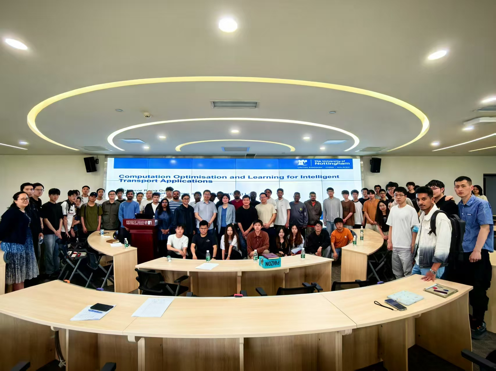
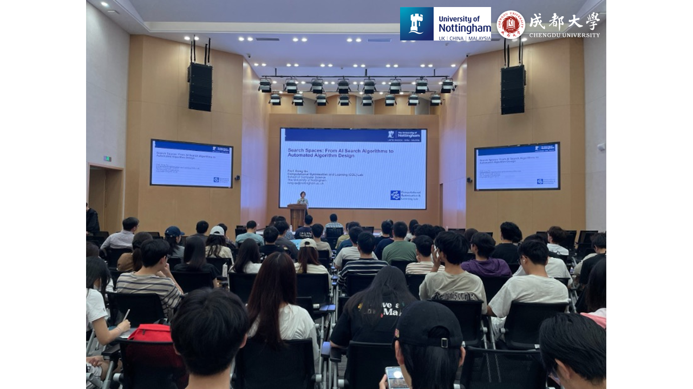

# 实验室对外交流与合作 · 开放基金项目 Laboratory Open Fund

[← 返回总目录](../README.md) · [← 学术会议](academic-conferences.md) · [高校合作 →](university-cooperation.md)

宁波市数字港口技术重点实验室开放基金项目，旨在加强科研合作，推动港口技术和物流领域的创新。该项目诚邀全球研究人员和行业专家申请资助，并合作开展符合实验室战略目标的项目。

> The Ningbo Key Laboratory of Digital Port Technologies has announced the launch of its Open Fund Project, aiming to enhance research partnerships and drive innovation in port technology and logistics. This initiative invites researchers and industry experts from around the globe to apply for funding and collaborate on projects that align with the lab's strategic objectives.

实验室以开放、流动、联合、竞争为原则，设立开放合作课题基金，**2023–2025 年度共立项资助 7 项高质量开放课题**，面向全国乃至全球高校院所开放共享平台资源，聚焦数字港口核心技术瓶颈开展联合攻关。课题方向覆盖港口运筹优化、多模态智能感知、数字孪生、边缘计算、无人机应急调度等关键领域，承担单位包括新西兰惠灵顿维多利亚大学、西南交通大学、中南大学、大连理工大学、深圳大学、成都大学、桂林电子科技大学等国内外知名高校。通过严格评审、过程管理、成果考核，已产出一批高水平论文（含中科院一区、IEEE 汇刊、CCF 会议）与算法 / 系统原型，推动产学研深度融合。

> The Ningbo Key Laboratory of Digital Port Technologies has launched its Open Fund Project, aiming to enhance research partnerships and drive innovation in port technology and logistics. Guided by the principles of openness, mobility, collaboration and competition, the laboratory has supported 7 high-quality open projects from 2023 to 2025, sharing platform resources with domestic and global universities. Partners include Victoria University of Wellington, Southwest Jiaotong University, Central South University, Dalian University of Technology, Shenzhen University, Chengdu University, Guilin University of Electronic Technology, and other renowned institutions.

## 合作高校（代表）

### 新西兰惠灵顿维多利亚大学 Victoria University of Wellington

*Victoria University of Wellington，2025，新西兰惠灵顿大学*

### 西南交通大学 Southwest Jiaotong University

*Southwest Jiaotong University，西南交通大学*

### 成都大学 Chengdu University

*Chengdu University，成都大学*
