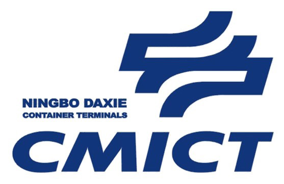

# 实验室对外交流与合作 · 校企合作 School-Enterprise Cooperation

[← 返回总目录](../README.md) · [← 高校合作](university-cooperation.md) · [产学研合作 →](iur-cooperation.md)

实验室与企业和政府单位拥有多项合作。

> The laboratory has a number of cooperation with enterprises and government units.

