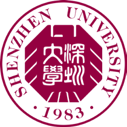
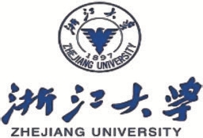

# 实验室对外交流与合作 · 高校间合作 Inter-university Cooperation

[← 返回总目录](../README.md) · [← 开放基金](open-fund.md) · [校企合作 →](school-enterprise.md)

实验室与众多世界知名高校有广泛合作。

> The laboratory has extensive cooperation with many world-renowned universities.

