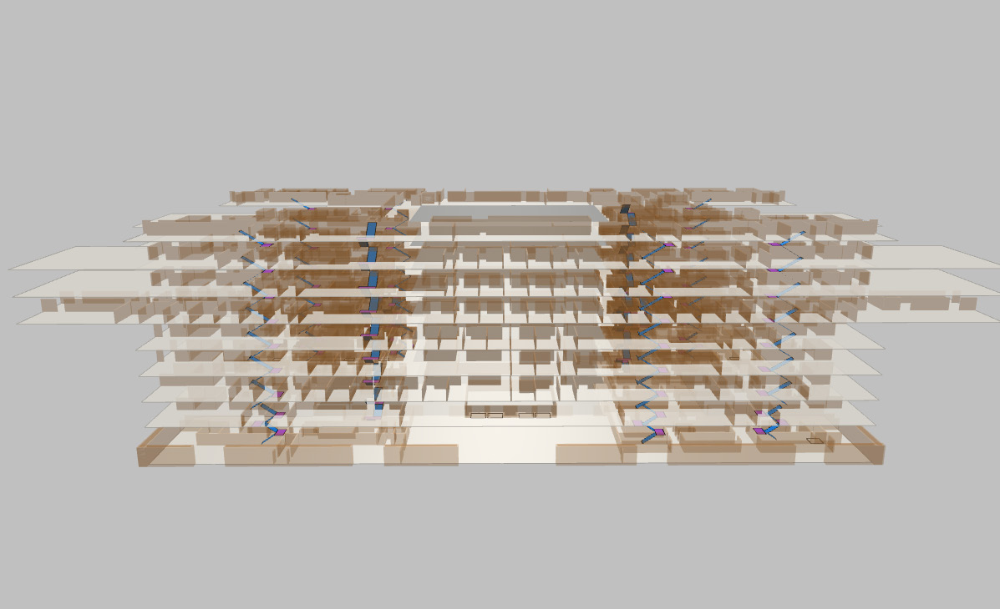

# 案例应用 · 楼宇智能应急仿真系统 Intelligent Building Emergency Simulation System

[← 返回总目录](../README.md) · [← 案例目录](overview.md)

## 项目概述

为推进未来社区发展建设，与宁波市福明街道合作搭建楼宇智能应急仿真系统。使用离散仿真技术，根据现实福明街道住宅和商业楼搭建仿真模型，导入虚拟人员，进行在火灾等危险事故发生时人员疏散的仿真模拟。

> In order to promote future community development and construction, we cooperated with Ningbo Fuming Street to build a building intelligent emergency simulation system. Using discrete simulation technology, we build simulation models based on real Fuming Street residential and commercial buildings, and import virtual personnel to simulate the evacuation of people when dangerous accidents such as fire occur.

## 功能特点

- **社区建模 Community Modeling**：建立仿真模型，科学评估活动安排。Building simulation models, scientific evaluation of activities arrangement.
- **方案评估 Solution Evaluation**：每层逃生时间是否可行，人员安排是否合理。Feasibility of the escape time on each floor, rationality of the staffing arrangement.
- **场景复现 Scene Reproduction**：全景摄像头构建 720 度全景监控。Panoramic camera builds 720-degree surveillance.
- **应急培训 Emergency Training**：不同区域推荐最短逃生路线三维导引。3D guidance for the shortest escape route recommended in different areas.
