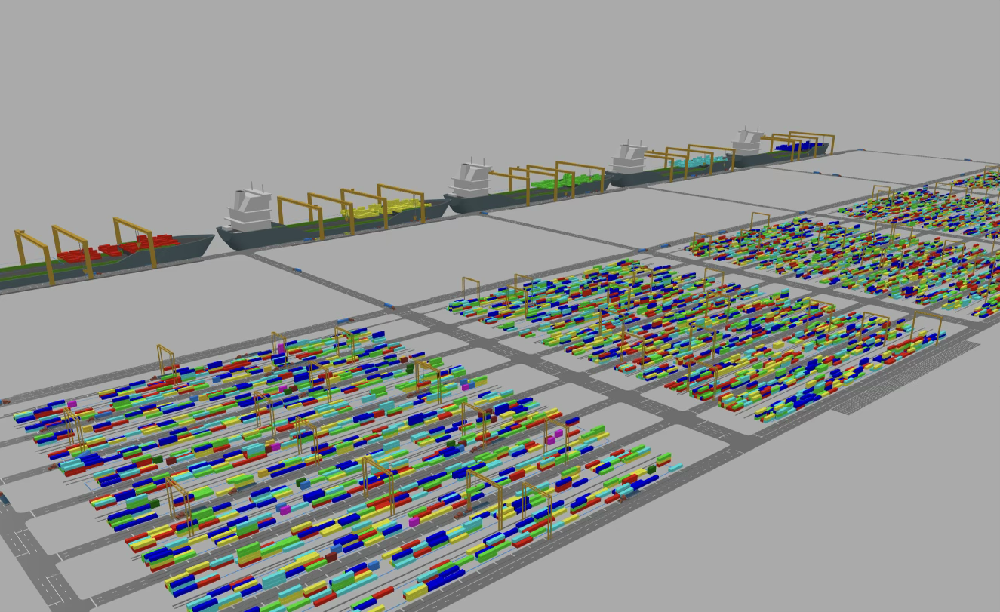
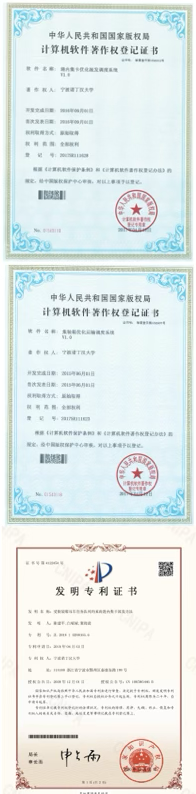

# 案例应用 · 宁波港港口作业调度优化 Ningbo Port Operation Scheduling Optimization

[← 返回总目录](../README.md) · [← 案例目录](overview.md)

*基于 HyFlex3.0 的集卡调度优化 / Container Truck Scheduling Optimization Based on HyFlex3.0*

*宁波舟山港车辆调度问题 / Ningbo Zhoushan Port Vehicle Dispatching Problem*

## 项目概述

针对宁波港现有问题，研发了一套基于超启发式算法的港内集卡自动派发模型和一套跨码头集装箱转运优化系统。提高了集装箱卡车的重载率，降低集卡行驶距离，为港口经济发展提速增效，助力打造绿色港口。

> Aiming at the existing problems of Ningbo port, a set of automatic distribution model of in-port container truck based on hyper-heuristic algorithm and a set of inter-terminal container transfer optimization system are developed. The heavy load rate of container truck is improved and the travel distance of container truck is reduced, accelerating and increasing the efficiency of port economic development and helping build a green port.

## 核心问题 Problem Statement

- **调度自动化程度低**，过度依赖操作人员。Low degree of scheduling automation and excessive reliance on operators.
- **资源利用率低**，重载率低，设备利用率低。Low resource usage, low overload rate, and low device usage.
- **用户交互方式差**，终端交互方式少，数据收集不完整。Poor user interaction, less terminal interaction, incomplete data collection.
- **缺乏预测**，计划不准确。Lack of prediction, inaccurate planning.

