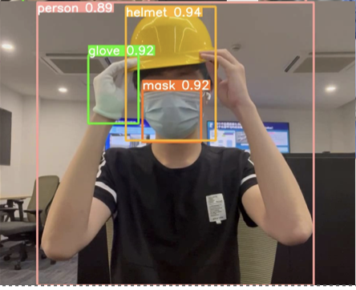
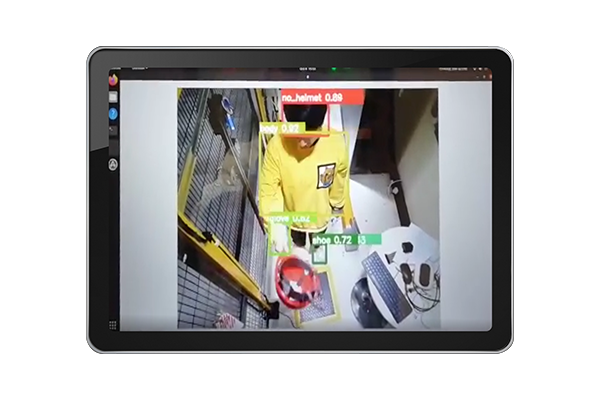
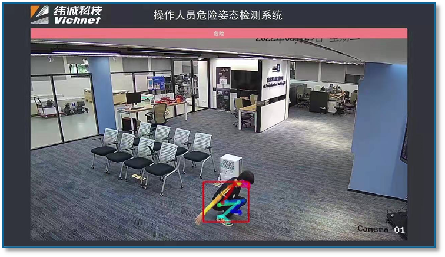
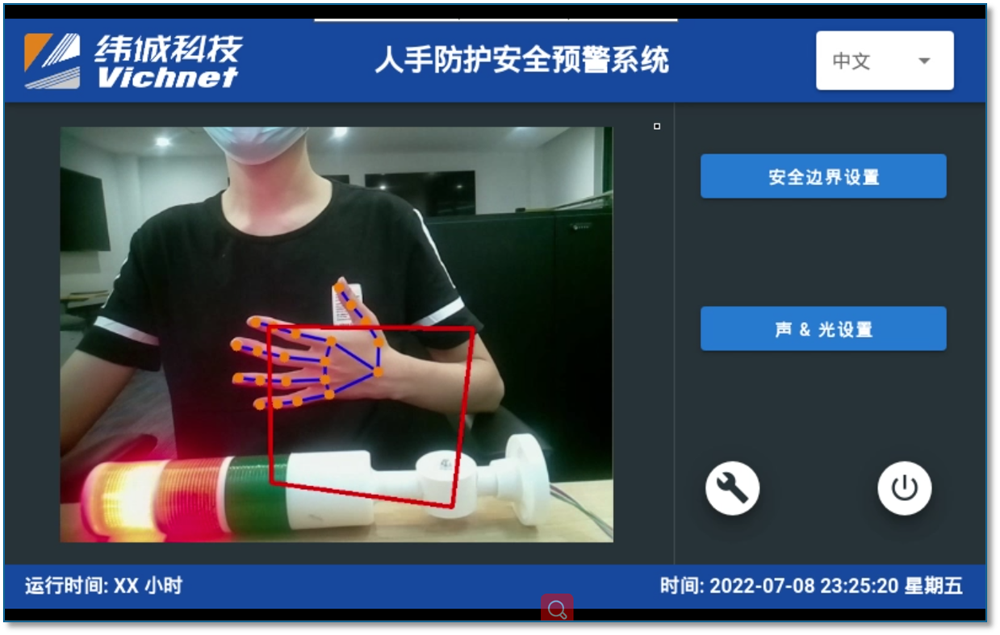
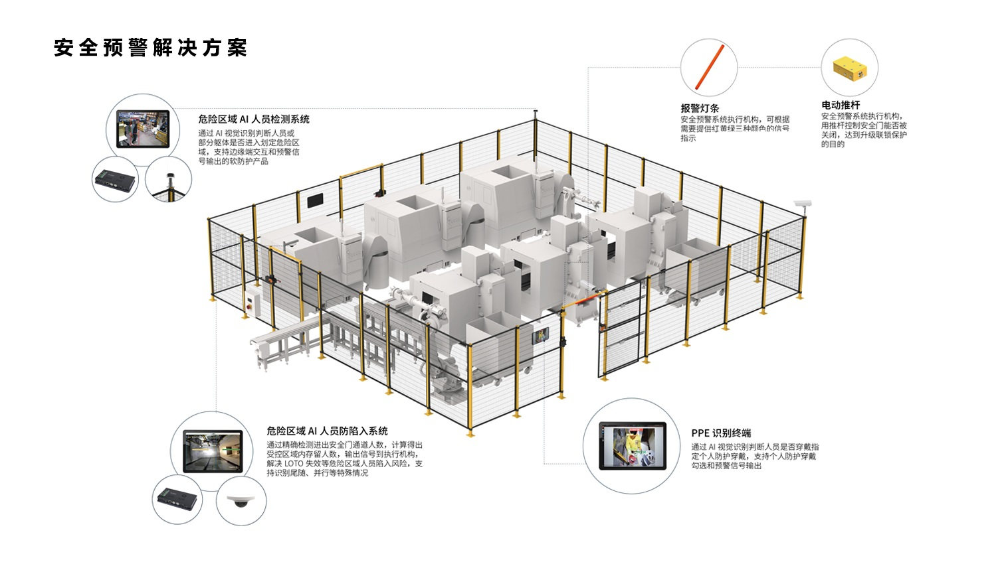

# 案例应用 · 基于工业互联网的安全生产数字孪生系统关键技术研究 Research on Key Technologies of Safe Production Digital Twin System

[← 返回总目录](../README.md) · [← 案例目录](overview.md)

## 项目概述

实验室承接 2021 年度宁波市第一批重大科技攻关暨"揭榜挂帅"项目，和宁波纬诚科技股份有限公司竭诚合作，应用 5G 技术、边缘计算、智能学习、目标识别技术，构建了一套安全生产数字孪生系统，形成一个典型危险源与危险行为识别算法库，实现危险事件的预警预测，和对人员、设备、生产、仓储、物流和环境等方面的智能化监测与预警。

项目目前已完成对多种场景下的火焰、烟雾识别，以及对多种人员行为的精确识别及分类。另外，该项目也实现了对人员 PPE 设备的佩戴状态的检测，计划实现对车辆逆行、安全员离岗等其他危险事件的识别与预警。

> Lab undertook 2021 Ningbo's First Major Scientific Research Project, cooperating with Ningbo Weicheng Technology Co., Ltd., applying 5G, edge computing, intelligent learning, and object identification technology to build a production safety digital twin system, forming a typical hazards and risk behavior recognition algorithm library, realizing warning and prediction of dangerous events, and intelligent monitoring of personnel, equipment, production, storage, logistics and environment.

## 识别效果

*PPE 识别效果*

*对明火识别效果*

*通过人工智能技术实现的智能化室内定位系统 / Intelligent Indoor Positioning System through AI*

*使用边缘计算系统的 PPE 识别终端 / PPE identification terminals using edge computing systems*

*危险姿态识别 / Hazardous Posture Recognition*

*人手防护安全预警 / Manual protection security alert*

## 落地与意义

项目成果已在宁波市工业场景成功落地应用，有效提升了区域安全生产管理水平，为工业互联网安全体系构建提供创新解决方案。通过探索数字孪生技术在工业安全领域的深度应用，不仅加速了我国智慧安防技术的产业化进程，也为实验室积累了宝贵的核心技术与工程实践经验。

> This breakthrough implementation in Ningbo's industrial sector has significantly enhanced regional safety management standards, providing an innovative solution for industrial internet security systems, accelerating the industrialization of intelligent safety technologies in China, and establishing valuable technical expertise and engineering know-how for our laboratory.

*针对工业安全的全套智能安全产品配套方案 / A complete set of intelligent safety product solutions for industrial safety*
