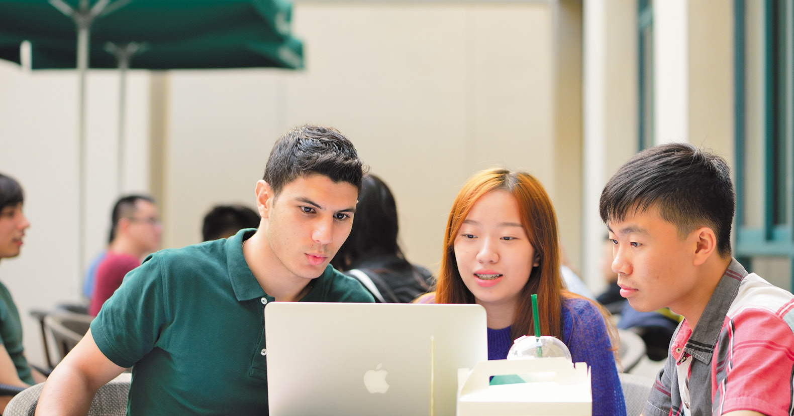
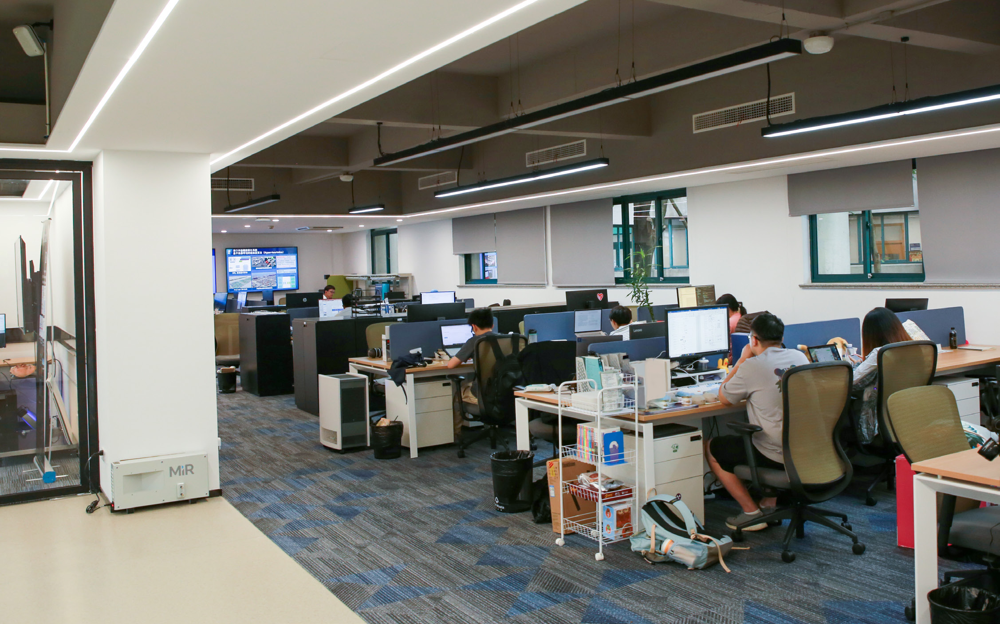

# 人才培养 · 博士招生 Doctoral Research Opportunities

[← 返回总目录](../README.md) · [硕士招生 →](masters.md) · [联系方式 →](contact.md)

## 培养理念

本实验室致力于培养具有国际视野、多方面发展、对于前沿计算机科学知识和人工智能技术感知敏锐的人才。本实验室对博士生的未来发展提供专业指导，包括学术、工业界和创业等方向。本实验室导师拥有丰富的指导在读博士于世界顶级 SCI 期刊和学术会议上发表论文的经验，更有博士第一学年论文即被一流学术会议收录的先例。

> The laboratory is committed to train talents with international vision, multi-faceted development, and keen perception of cutting-edge computer science knowledge and artificial intelligence technology. This laboratory provides professional guidance for the future development of doctoral students, including academic, industrial and entrepreneurial directions. The tutors have rich experience in guiding doctoral students to publish papers in the world's top SCI journals and academic conferences, and there is a precedent for first-year doctoral papers to be included in first-class academic conferences.

## 招生项目

实验室开设若干博士招生项目，包括与世界知名的国内外大学合作合办的若干联合培养项目，涵盖智能计算、运筹优化、计算机视觉、自然语言处理等方向。

## 学位与学制

- 毕业博士生将获得英国诺丁汉博士学位，自动获教育部认证。Graduate PhD students will obtain a PhD degree from University of Nottingham UK, recognized by the Ministry of Education.
- 全职学生毕业时间在 **3-4 年**。Full-time students graduate in 3-4 years.

## 申请时间

入学日期在每年 **二月和九月**，奖学金申请截止日期在每年 **10 月和 5 月**。

> Admission dates are in February and September, and scholarship application deadlines are in October and May.

## 申请要求

申请人需要拥有相应学科研究生学历，且均分高于 **65（英国）/ GPA 3.5（美国）/ 85（中国）**，或拥有相应学科本科学历且表现优异（70 / 3.5 / 90）。

> Applicants are required to have a Master's degree with an average score above 65 (UK) or GPA 3.5 (US) or 85 (China) in the relevant subject, or an honours bachelor's degree with distinction.

## 英语要求

母语非英语的申请者需要出示相关英文能力证明：

- **雅思**：6.5，小分不低于 6.0
- **托福**：87，最低听力 19、写作 19、阅读 19、口语 20
- 或拥有英文授课学校文凭

> IELTS 6.5 with a minimum score of 6.0; TOEFL 87 with a minimum of 19 in Writing and Listening, 19 in Reading, 20 in Speaking; or a diploma from a university taught in English.

## DTP 联合培养合作单位

博士生 DTP 项目合作单位包括：中科院上海高等研究院、中科院深圳先进技术研究院、浙江大学、深圳大学。

> PhD DTP partner institutes include Shanghai Advanced Research Institute, Shenzhen Institute of Advanced Technology (CAS), Zhejiang University, Shenzhen University.

## 导师与奖学金

- 申请者将接受 **至少两位导师** 的指导；若选择 DTP 项目，可接受宁波诺丁汉、英国诺丁汉和其他世界知名大学或研究机构高级学者的联合培训。
- 申请者可从 **30 多个奖学金** 中选择最适合的项目，奖学金至少涵盖三年的学费，同时每个月会发放一笔生活费。

> Applicants will have at least 2 supervisors. If they choose the DTP program, they will receive joint training with senior scholars from UNNC, UNUK and other world-renowned universities or research institutions. Applicants can choose from 30+ scholarships that cover at least three years of tuition and a monthly stipend for living expenses.

