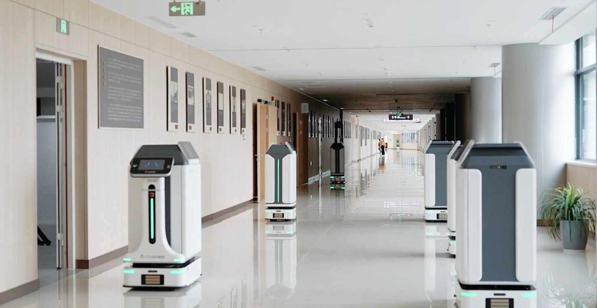
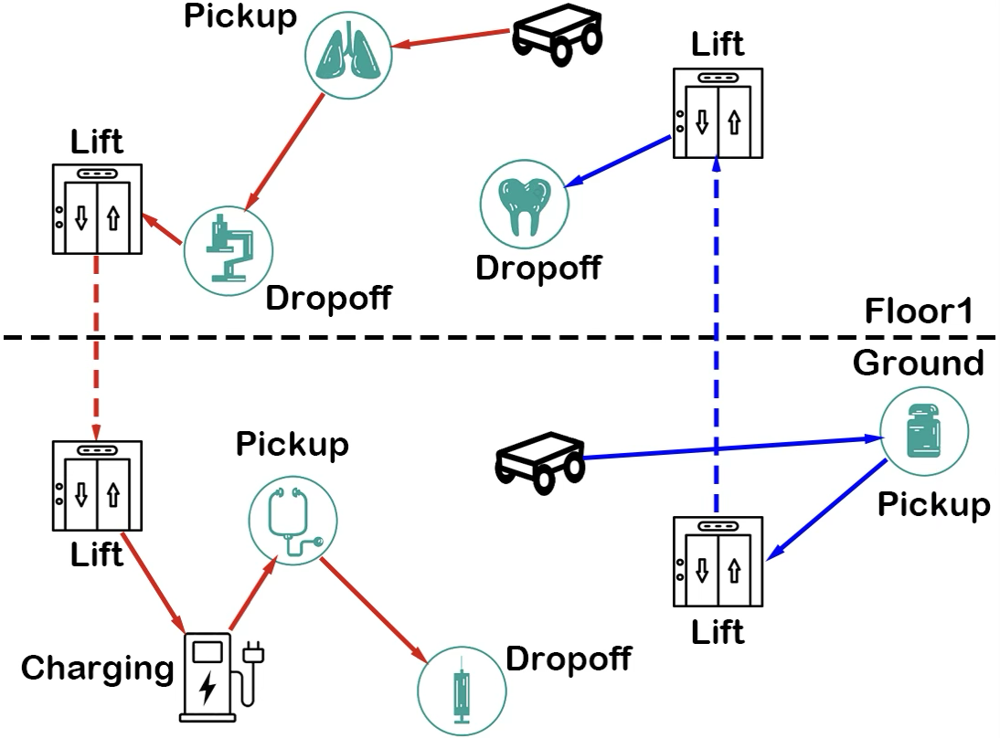
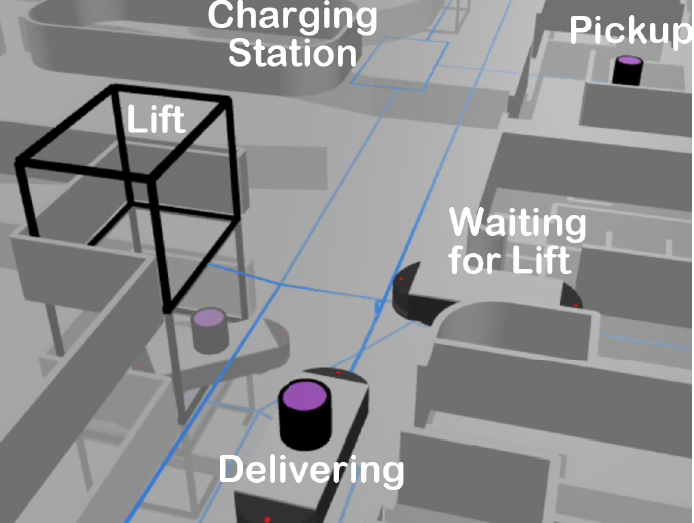
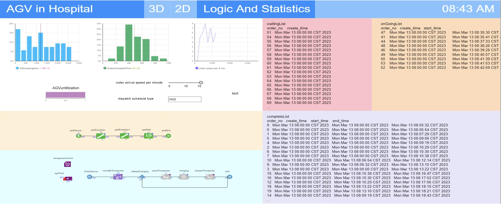

**第一医院数字孪生 AGV 调度优化仿真案例**

*医院 AGV 应用*

*AGV 医院作业流程*

*AGV 仿真建模*

## 项目概述

该项目依托第一医院复杂诊疗场景，研究基于数字孪生技术的 AGV（自动导引车）智能调度优化方法。

## 研究内容

1. **数字孪生建模与场景仿真**：构建医院三维动态孪生模型，模拟门诊、药房、急诊等多场景的 AGV 运行环境，集成人流、物流及突发任务等随机变量。
2. **动态调度算法开发**：基于 Anylogic 平台设计多目标优化算法，实现 AGV 路径规划、任务优先级分配及资源冲突消解，提升对临时加急任务和设备故障的响应能力。
3. **仿真验证与系统集成**：通过虚拟现实交互界面验证调度策略有效性，开发孪生驱动的 AGV 智能调度系统，并在医院真实场景中开展示范应用。

*AGV 统计界面*

## 意义

该研究可以推动医院物流管理智能化转型，优化医疗资源调配效率，降低运营成本，为智慧医院建设提供可复用的技术范式。
