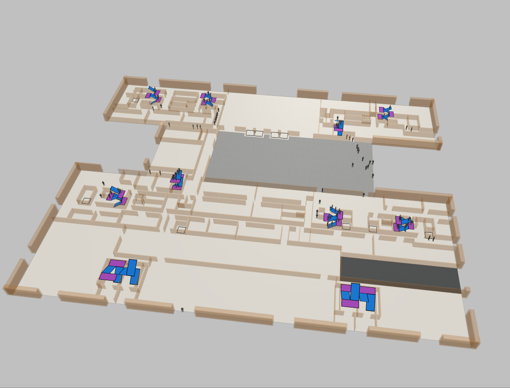

## 项目概述

为推进未来社区发展建设，与宁波市福明街道合作搭建楼宇智能应急仿真系统。使用离散仿真技术，根据现实福明街道住宅和商业楼搭建仿真模型，导入虚拟人员，进行在火灾等危险事故发生时人员疏散的仿真模拟。

## 功能特点

- **社区建模**：建立仿真模型，科学评估活动安排。
- **方案评估**：每层逃生时间是否可行，人员安排是否合理。
- **场景复现**：全景摄像头构建 720 度全景监控。
- **应急培训**：不同区域推荐最短逃生路线三维导引。
