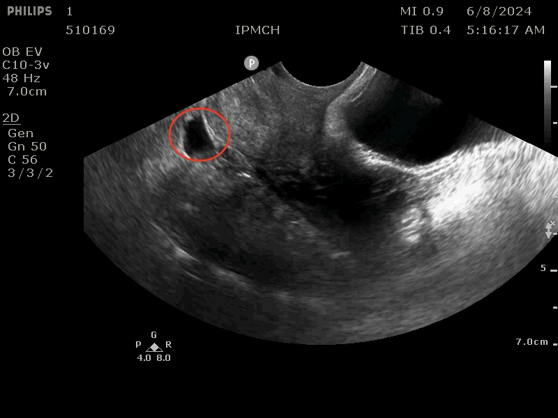
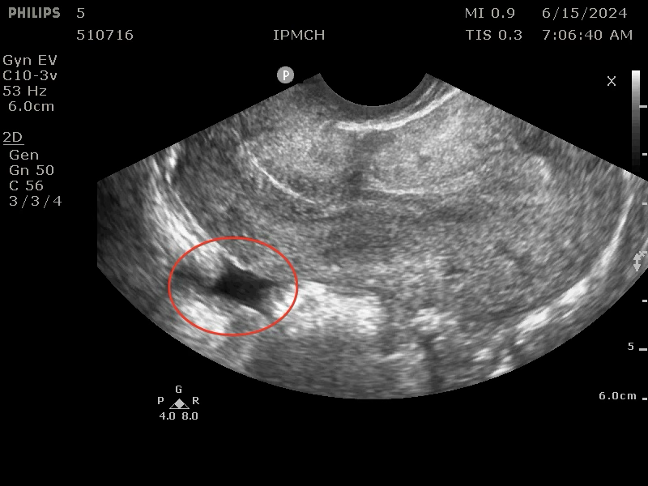

## Background

CSD has emerged as a critical clinical challenge in China due to high cesarean section rates, with millions of new cases annually. This research focuses on intelligent diagnosis algorithms for CSD segmentation in ultrasound images using deep learning and image processing. The work has been published in IEEE ICASSP (CCF-B).

## Research Content

1. **Algorithm Development and Multi-Disease Adaptation**: Through deep learning model optimization, achieve automated high-precision segmentation of CSD regions in ultrasound images; the technology is extensible to the diagnosis of multiple gynecological conditions.
2. **Multimodal Technology Integration**: Combine image enhancement, feature extraction, and 3D reconstruction technologies to address ultrasound image noise interference and structural blurring.
3. **Clinical Validation and Application**: Validate with hospital clinical data, providing physicians with quantitative lesion analysis tools to assist in treatment decision-making.

## Significance

The technology will significantly improve CSD screening efficiency and standardize the diagnosis of post-cesarean complications.
