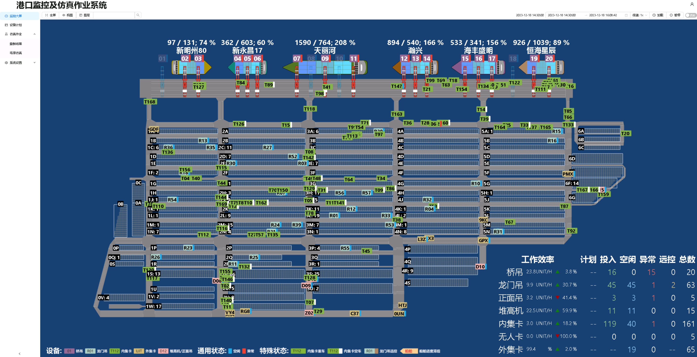
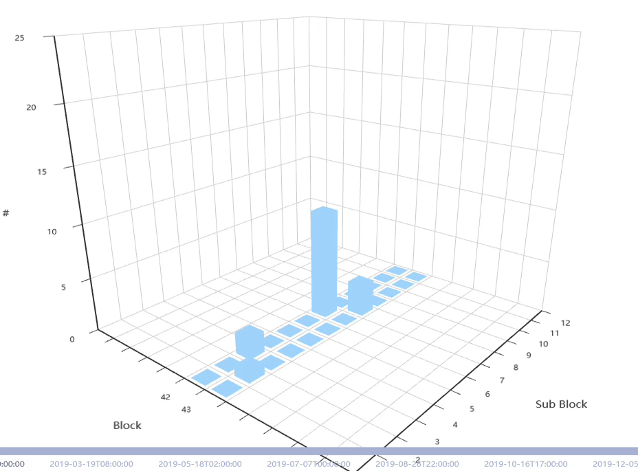
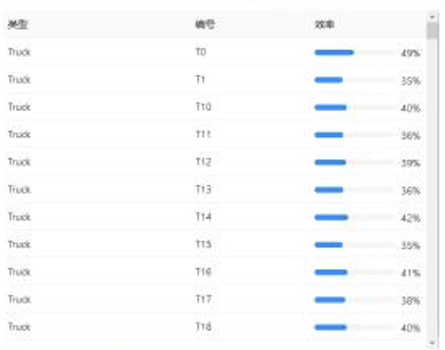
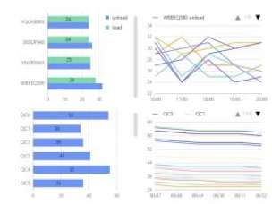
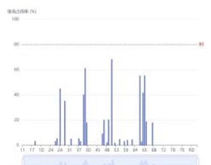
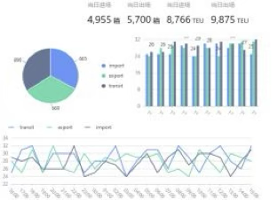
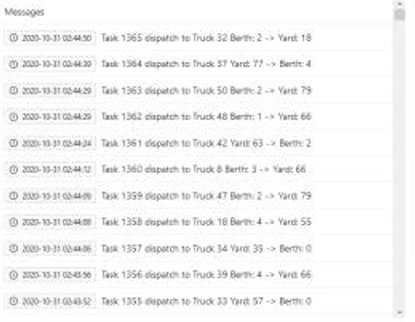
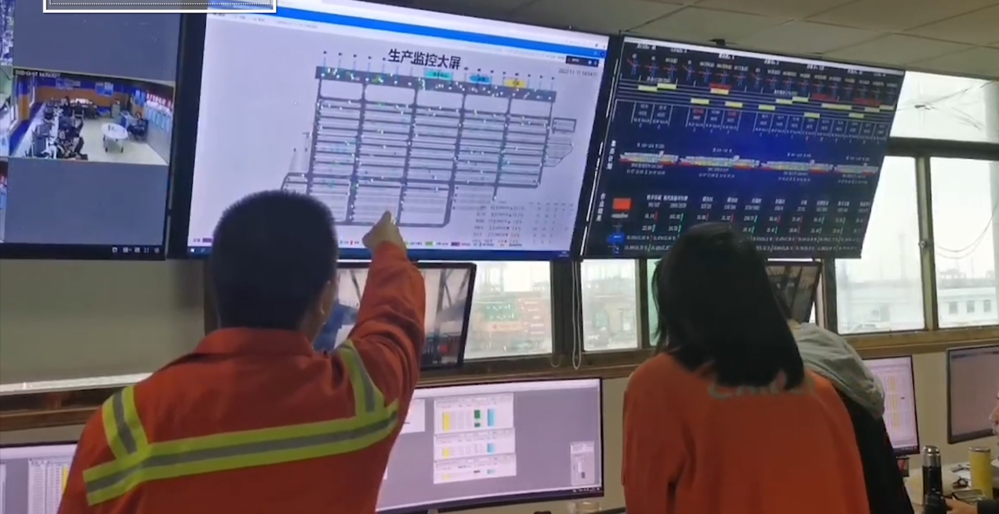

## Overview

At the request of Ningbo Daxie Merchants International Terminal Co., Ltd., we developed a set of intelligent large-screen solution based on intelligent simulation technology, breaking the data barrier, providing guarantee for the transparency of dock production operation, and improving the soft power of the dock.

*Operation Simulation Scenario*

## Functional Modules

*Yard Heatmap*

*Truck & Equipment Efficiency*

*QC & Ship Efficiency*

*Yard Load and Distribution*

*Port Operation Summary*

*Key Events*

## Smart Screen Features

- Job visualization, efficiency visualization, state visualization
- Data playback, in-depth study of the problem of reproduction operation
- Real-time simulation, predict efficiency bottlenecks
- End-to-end transmission, you can see the big picture without leaving home
- Deeply embedded safety guarantee system, real-time monitoring of production safety

*On-site demonstration of system operation*
