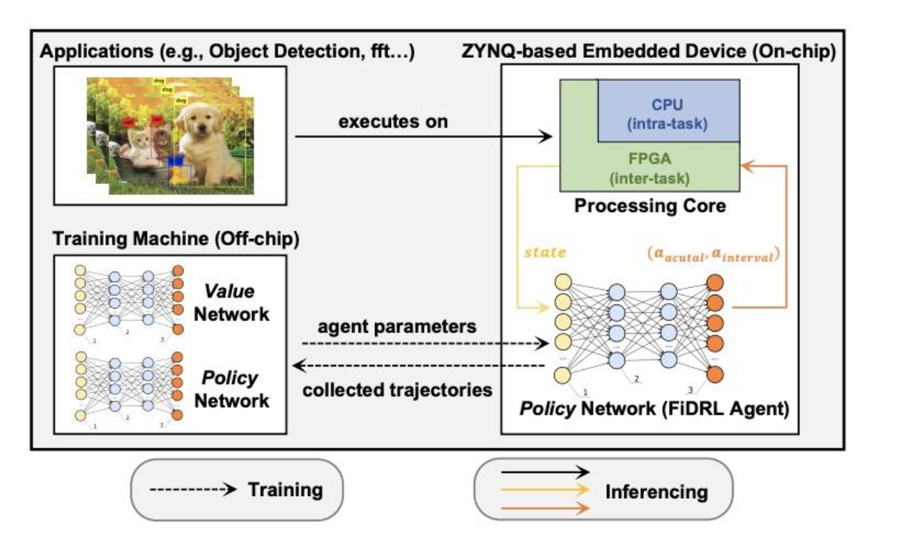
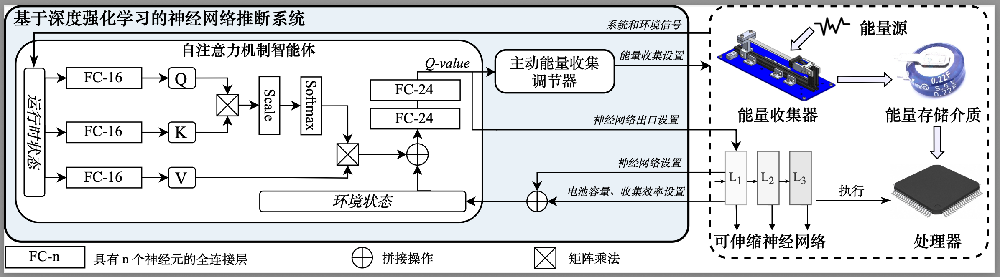

## 项目概述

本项目由浙江省基础公益研究计划支持，聚焦于未来绿色与自主的人工智能物联网（AIoT）设备，在能源采集（EH）系统中实现可持续的深度神经网络（DNN）推理。传统的被动能量适应策略只能基于观测或预测的能量输入对 DNN 计算负载进行静态调节，在面对高计算需求时常陷入性能瓶颈，难以兼顾能源效率与推理质量。为突破上述限制，我们提出了一套基于主动能量采集的嵌入式 DNN 推理框架。

## 核心创新

我们提出了 **AcSRL**，一种基于主动能量采集的嵌入式 DNN 推理框架，核心创新体现在以下三个方面：

1. **AcSRL 动态推理框架**：一种通过主动能量收集（EH）和 DNN 动态推理的深度强化学习（DRL）方法，实现 DNN 计算深度与能量供给的实时匹配，适用于振动能量收集系统的 DNN 推理问题（实验能耗降低 15.22%）。
2. **自注意力 DRL 智能体 Agent Optimization**：基于自注意力架构的 DRL 智能体设计方案以做出高质量决策，并配备泛化的双深度 Q 网络（DDQN）训练算法。
3. **集成推理系统与工具链 Toolchain Development**：集成的基于振动能量收集的 DNN 推理系统和高效生成训练数据的工具链，以支持在各种能量收集条件下开发 AcSRL。

## 方法与成果

现有的方法通过灵活调整计算工作量，以被动观察或预测采集到的能量来优化 DNN 推理的能量消耗、延迟和准确性。然而，对于主动能源采集的场景，相关研究较少。对此，我们提出了一种基于主动能源采集的嵌入式 DNN 推理方法，使用自注意力 DDQN 强化学习（RL）。实验结果表明我们的方法改善了能源采集系统的持续性及 DNN 推理质量，实现了单次 DNN 推理能量消耗降低 15.22%，同时在准确性和延迟方面与现有最先进方法相比具备良好表现。
