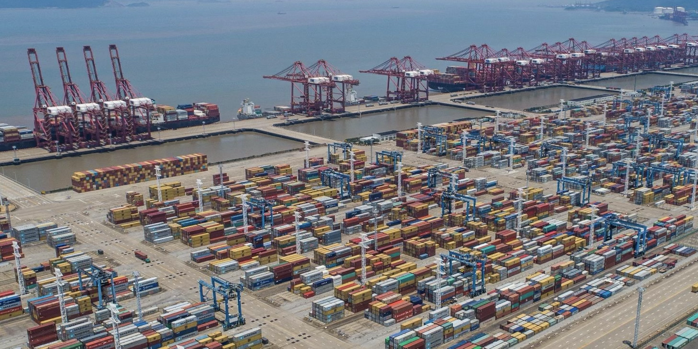

*基于 HyFlex3.0 的集卡调度优化*

*宁波舟山港车辆调度问题*

## 项目概述

针对宁波港现有问题，研发了一套基于超启发式算法的港内集卡自动派发模型和一套跨码头集装箱转运优化系统。提高了集装箱卡车的重载率，降低集卡行驶距离，为港口经济发展提速增效，助力打造绿色港口。

## 核心问题

- **调度自动化程度低**，过度依赖操作人员。
- **资源利用率低**，重载率低，设备利用率低。
- **用户交互方式差**，终端交互方式少，数据收集不完整。
- **缺乏预测**，计划不准确。

