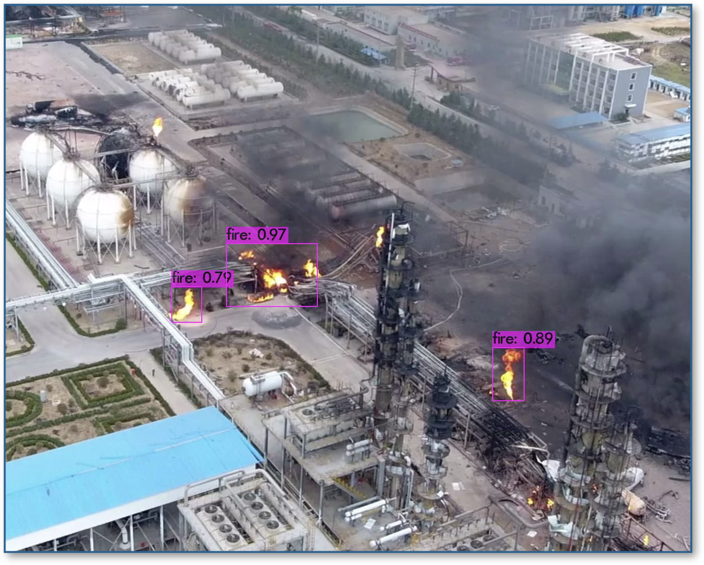
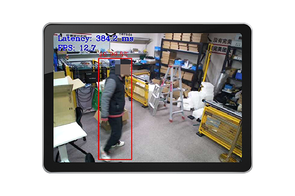

## 项目概述

实验室承接 2021 年度宁波市第一批重大科技攻关暨"揭榜挂帅"项目，和宁波纬诚科技股份有限公司竭诚合作，应用 5G 技术、边缘计算、智能学习、目标识别技术，构建了一套安全生产数字孪生系统，形成一个典型危险源与危险行为识别算法库，实现危险事件的预警预测，和对人员、设备、生产、仓储、物流和环境等方面的智能化监测与预警。

项目目前已完成对多种场景下的火焰、烟雾识别，以及对多种人员行为的精确识别及分类。另外，该项目也实现了对人员 PPE 设备的佩戴状态的检测，计划实现对车辆逆行、安全员离岗等其他危险事件的识别与预警。

## 识别效果

*PPE 识别效果*

*对明火识别效果*

*通过人工智能技术实现的智能化室内定位系统*

*使用边缘计算系统的 PPE 识别终端*

*危险姿态识别*

*人手防护安全预警*

## 落地与意义

项目成果已在宁波市工业场景成功落地应用，有效提升了区域安全生产管理水平，为工业互联网安全体系构建提供创新解决方案。通过探索数字孪生技术在工业安全领域的深度应用，不仅加速了我国智慧安防技术的产业化进程，也为实验室积累了宝贵的核心技术与工程实践经验。

*针对工业安全的全套智能安全产品配套方案*
