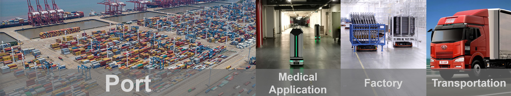

## 系统介绍

Simplex AI 数字孪生调度优化系统基于宁波市数字港口技术重点实验室创新成果，深度融合人工智能与数字孪生技术，实现生产全流程的实时映射与智能决策。系统通过构建实体工厂/设备的动态数字孪生体，突破传统工业软件（PLM/MES/ERP/港口 TOS 等）依赖人工调度的局限，能够监控全场实时数据，智能调度运输车辆 AGV，智能分配工作任务，从而提高生产作业效率，显著提升资源利用效率与生产响应速度。

## 核心技术优势

1. **全要素数字映射**：通过高精度三维建模与 IoT 数据集成，实现工厂设备、运输载具（AGV）及生产流程的实时孪生映射，支持生产状态的秒级监控与预测性维护。
2. **智能调度引擎**：集成多算法融合架构，涵盖超启发式优化算法、深度强化学习模型、动态路径规划技术。
3. **跨场景泛化能力**：系统算法本身能够在多种业务场景中泛用，如港口、工厂、医院、物流等。

*SimplexAI 简优数字孪生优化系统路演*

*服装厂 AGV 实施部署*

## 落地应用与获奖

团队目前已在宁波港落地基于人工智能的集卡优化运输系统，已达成年节省 1000 万元的目标；同时团队与宁波港大榭码头合作进行中的生产大屏数字孪生智能监控系统项目，能够对码头的过去、现在、未来的操作进行监控和预测，提高码头生产效率，为打造码头"数字大脑"助力，未来可将相关系统推广至其他港口和相关物流类企业。

*中国工业互联网大赛*

该系统创新产品获得第四届中国工业互联网大赛新锐组全国最佳技术创新奖。
